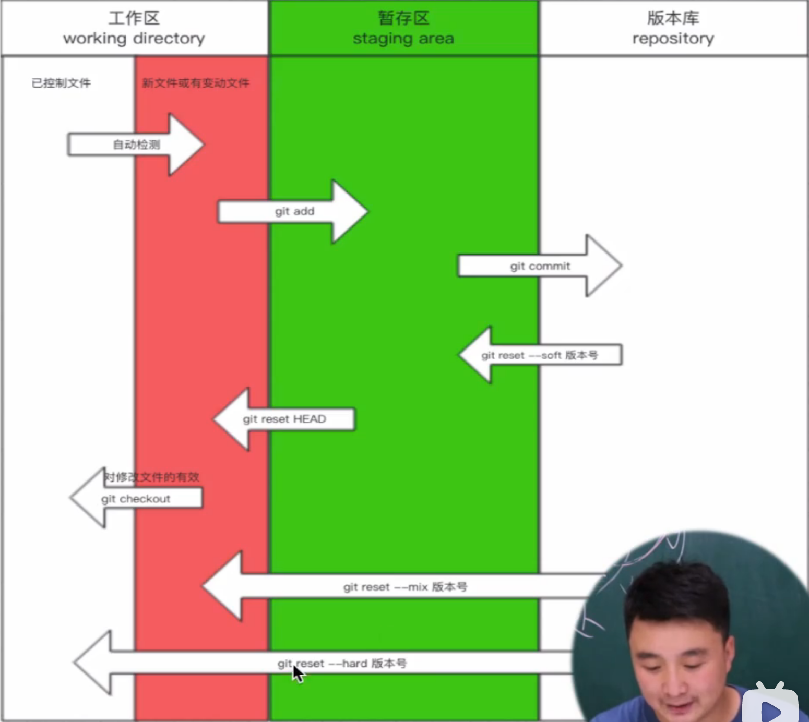

#### 一、单机操作

文件的三个区域：

​	工作区：就是你写文件的地方

​	缓存区：暂时存放文件的地方，可以提交，也可以回到工作区

​	版本库：交给git来管理的版本库，可以回退到缓存区，也可以回退到工作区



```shell
# 初始化
git init 
# 查看状态
git status
# 查看当前的日志，正常流程的日志（不包含回退的日志）
git log
# 查看所有的日志（包含回退的日志）
git reflog

# 1自动检测，由无修改-》有修改

# 2工作区 -》 缓存区
git add .
# 3缓存区 -》 版本库
git commit -m 'message'
# -3版本库 -》 缓存区  把差异集合并到一块，然后放入到缓存区中
git reset --soft 'hash'
# -2缓存区 -》 工作区
git restore --staged index.html # 或git reset HEAD index.html
# -1有修改 -》 无修改
git restore index.html # 或git checkout -- index.html

# -3版本库  -》 工作区 把差异集合并到一块，然后放入到工作区，有冲突以本地为准。
git reset --mixed 'hash' # 默认选项
# -3版本库  -》 无修改 还原一切
git reset --hard 'hash'
```

```shell
# 查看当前分支
git branch
# 创建分支，以当前所在分支为基准，创建分支
git branch dev
# 切换分支
git checkout dev
# 分支合并，选中基本分支，把其他的分支合并过来。可能会有冲突，解决冲突然后提交
git merge '要合并的分支'
# 删除分支
git branch -d dev
```

#### 二、远程协作

```shell
# 
git remote add origin https://github.com/lyjstudygithub/test
```


