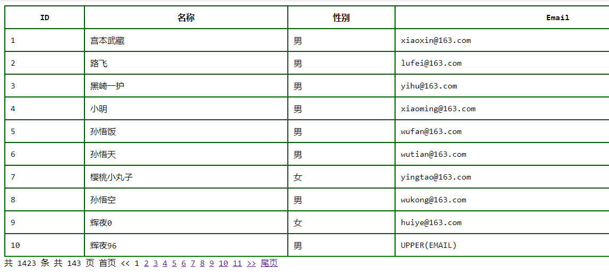
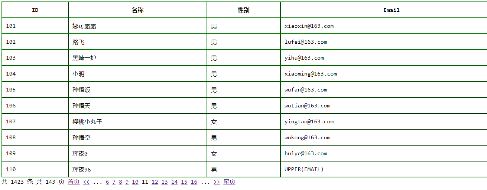

#### 一、概念

​	数据太多一个页面展示不全，需要分页显示。





#### 二、用法

```php
class MyPage
{
    private $cur_page;// 当前第几页

    private $first_page;// 去往 首页 的文字
    private $end_page;// 去往 尾页 的文字
    private $prev_page;// 去往 上一页 的文字
    private $next_page;// 去往 下一页 的文字

    private $page_size;// 每页显示条数
    private $total;// 总条数
    private $total_page;// 总页数
    private $num_size;// 当前页 前后展示多少页

    private $params = []; // 额外参数
    private $base_url; // 基础url

    /**
     * MyPage constructor.
     * @param array $page_config
     */
    public function __construct(array $page_config = [])
    {
        $this->cur_page  = $page_config['cur_page'];
        $this->total     = $page_config['total'];
        $this->page_size = $page_config['page_size'];
        $this->base_url  = $page_config['base_url'];

        $this->first_page = $page_config['first_page'] ?? '首页';
        $this->end_page   = $page_config['end_page'] ?? '尾页';
        $this->prev_page  = $page_config['prev_page'] ?? '上一页';
        $this->next_page  = $page_config['next_page'] ?? '下一页';

        $this->num_size   = $page_config['num_size'] ?? 5;
        $this->total_page = ceil($this->total / $this->page_size);

        $this->params = $page_config['params'] ?? [];
    }

    /**
     * 展示
     * @return string
     */
    public function showPage()
    {
        // 如果页数大于尺寸的时候，展示省略符
        $ext = $this->cur_page > $this->num_size ? '<span>...</span>' : '';

        $showPage = '';
        $showPage .= $this->show_total_row() . ' ';
        $showPage .= $this->show_total_page() . ' ';

        $showPage .= $this->show_first_page() . ' ';
        $showPage .= $this->show_prev_page() . ' ';

        $showPage .= $ext . ' ';
        $showPage .= $this->show_current_page() . ' ';
        $showPage .= $ext . ' ';

        $showPage .= $this->show_next_page() . ' ';
        $showPage .= $this->show_end_page() . ' ';

        return $showPage;
    }

    /**
     * 获取中间的分页（难点）
     */
    private function show_current_page()
    {
        if ($this->cur_page > $this->num_size) {
            $begin = $this->cur_page - $this->num_size;
            $end   = $this->cur_page + $this->num_size;

            if ($end > $this->total_page) {
                $begin = $this->total_page - $this->num_size * 2 > 0 ? $this->total_page - $this->num_size * 2 : 1;
                $end   = $this->total_page;
            }
        } else {
            $begin = 1;
            $end   = $this->num_size * 2 + 1;

            if ($end > $this->total_page) {
                $begin = 1;
                $end   = $this->total_page;
            }
        }

        $page_html = '';
        for ($i = $begin; $i <= $end; $i++) {
            if ($i == $this->cur_page) {
                $page_html .= "<span>{$i}</span>" . ' ';
            } else {
                $page_html .= "<span>{$this->get_link($i,$i)}</span>" . ' ';
            }
        }
        return $page_html;
    }

    /**
     * 获取上一页
     * @return string
     */
    private function show_prev_page()
    {
        if ($this->cur_page > 1) {
            return $this->get_link($this->cur_page - 1, $this->prev_page);
        }
        return "<span>{$this->prev_page}</span>";
    }

    /**
     * 获取下一页
     * @return string
     */
    private function show_next_page()
    {
        if ($this->cur_page < $this->total_page) {
            return $this->get_link($this->cur_page + 1, $this->next_page);
        }
        return "<span>{$this->next_page}</span>";
    }

    /**
     * 获取首页
     * @return string
     */
    private function show_first_page()
    {
        if ($this->cur_page > 1) {
            return $this->get_link(1, $this->first_page);
        }
        return "<span>{$this->first_page}</span>";
    }

    /**
     * 获取尾页
     * @return string
     */
    private function show_end_page()
    {
        if ($this->cur_page < $this->total_page) {
            return $this->get_link($this->total_page, $this->end_page);
        }
        return "<span>{$this->end_page}</span>";
    }

    /**
     * 获取访问地址，指定页数和文字，给你组合出来
     * @param $page
     * @param $text
     * @return string
     */
    private function get_link($page, $text)
    {
        $url = $this->base_url . '?page=' . $page;
        if (!empty($this->params)) {
            foreach ($this->params as $key => $val) {
                $url .= '&' . $key . '=' . $val;
            }
        }
        return "<span><a href='{$url}'>{$text}</a></span>";
    }

    /**
     * 返回总共多少条
     * @return string
     */
    private function show_total_row()
    {
        return "共 {$this->total} 条";
    }

    /**
     * 返回总共多少页数
     * @return string
     */
    private function show_total_page()
    {
        return "共 {$this->total_page} 页";
    }

    /**
     * 简单的分页
     */
    public function showSimplePage()
    {
        $showPage = '';
        $showPage .= $this->show_prev_page() . ' ';
        $showPage .= $this->show_next_page() . ' ';
        return $showPage;
    }
}
```

