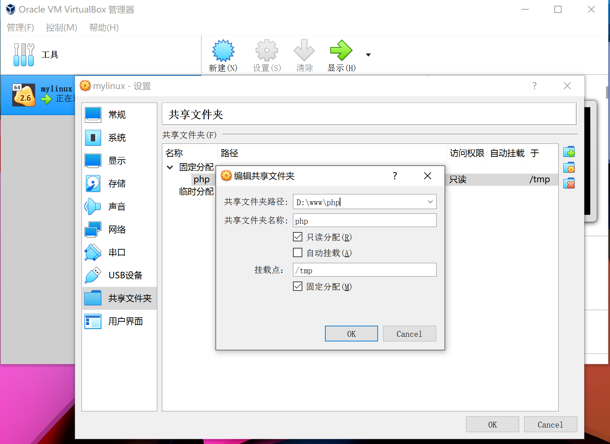

#### 1、下载VBox扩展增强包

```
https://www.virtualbox.org/wiki/Downloads

VirtualBox 6.1.26 Oracle VM VirtualBox Extension Pack
```

#### 2、安装VBox扩展增强包

```
管理 -> 全局设定 -> 扩展 -> 安装该扩展增强包
```

#### 3、设置共享目录



#### 4、在虚拟机中安装扩展增强包

```shell
mount /dev/sr0 /mnt/cdrom  # 挂载VBoxLinuxAdditions.iso文件
sh ./VBoxLinuxAdditions.run # 安装该功能
```

#### 5、挂载共享目录

```shell
mount -t vboxsf php /pcshare #挂载目录

umount /pcshare #取消挂载
```

#### 6、开机自动挂载

```
vim /etc/fstab 添加一行
php /pcshare vboxsf defaults 0 0
```


