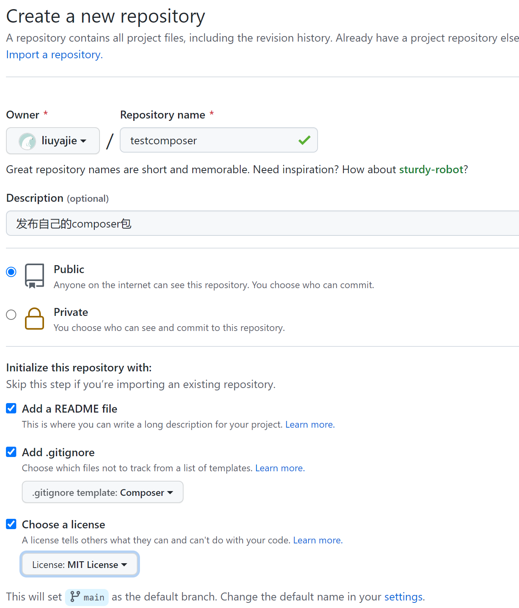
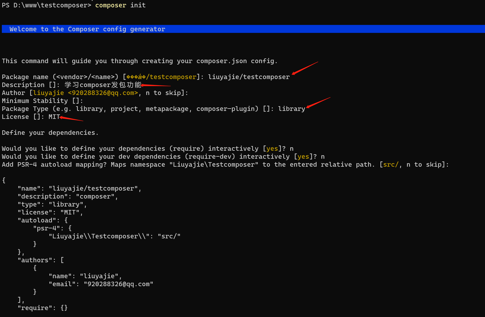
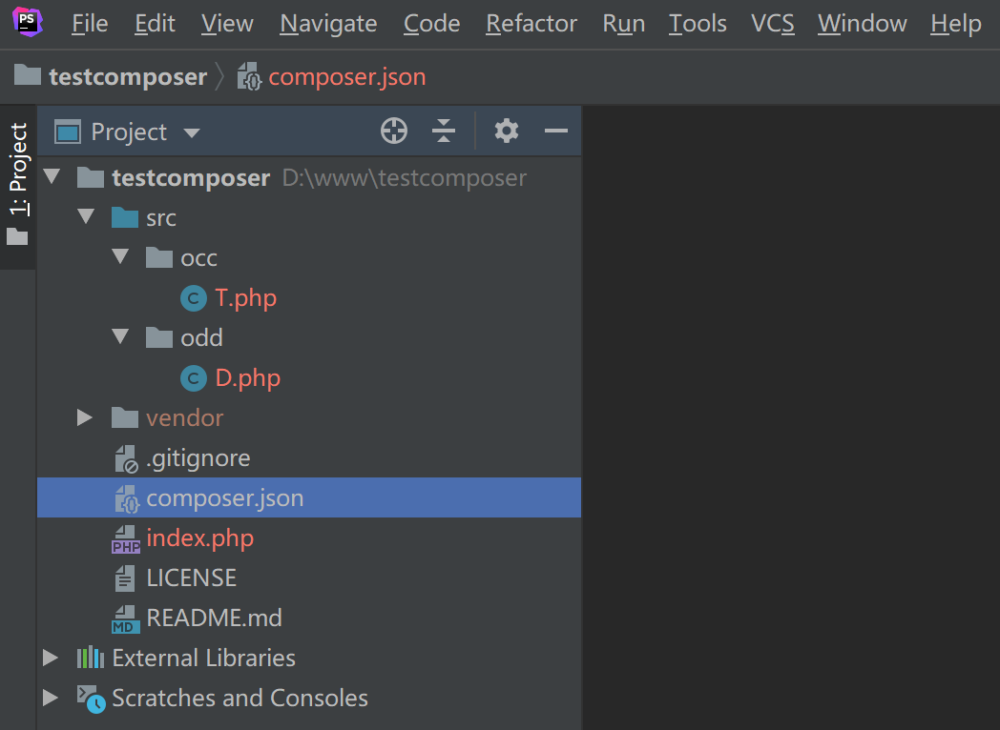
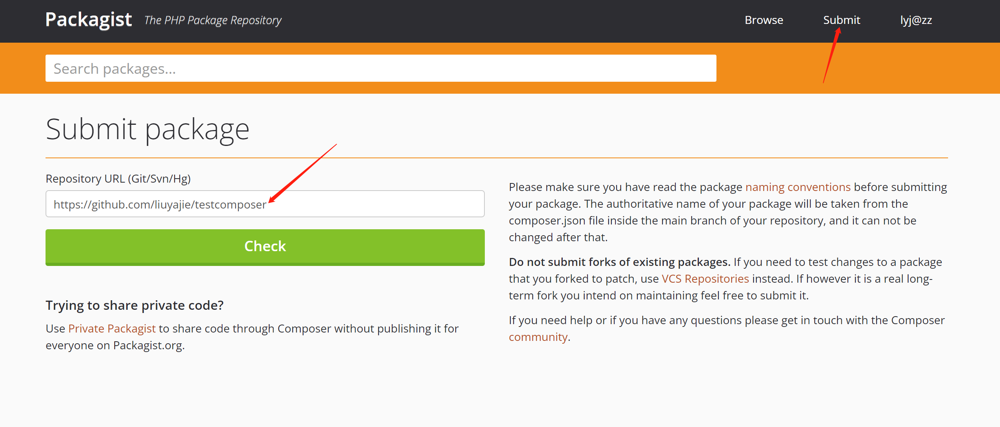
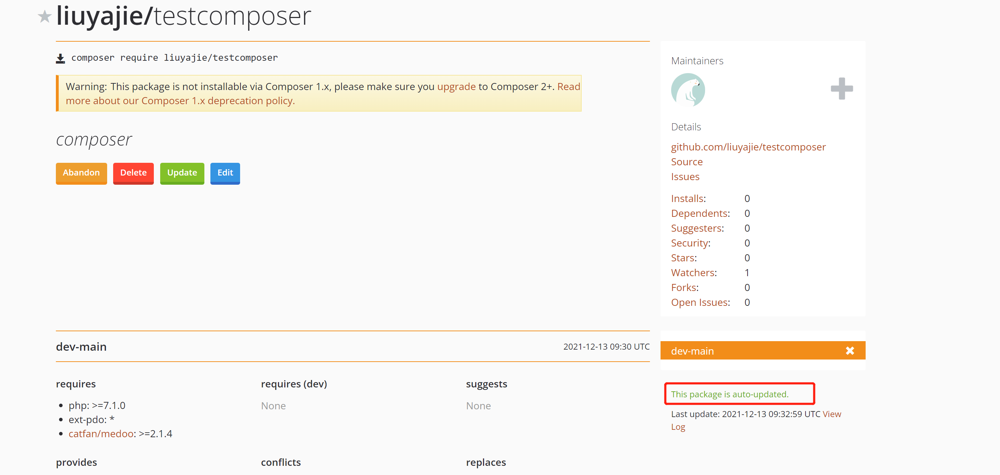
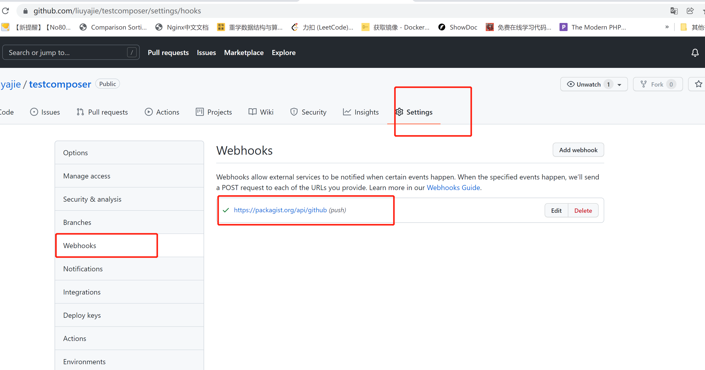

#### 一、准备工作

1. 注册github账号，https://github.com/
2. 注册packgist账号，https://packagist.org/
3. 安装好git软件及composer软件

#### 二、创建github仓库



```shell
# clone到本地
git clone https://github.com/liuyajie/testcomposer.git
```

#### 三、初始化

```shell
cd testcomposer
composer init
```



修改composer.json如下

```shell
{
    "name": "liuyajie/testcomposer",
    "description": "composer",
    "type": "library",
    "license": "MIT",
    "autoload": {
        "psr-4": {
            "Liuyajie\\Testcomposer\\": "src/"
        }
    },
    "authors": [
        {
            "name": "liuyajie",
            "email": "920288326@qq.com"
        }
    ],
    "require": {
		"php": ">=7.1.0",
		"ext-pdo":"*",
		"catfan/medoo":">=2.1.4"
	}
}
```

创建目录及文件如下



T.php

```php
<?php

namespace Liuyajie\Testcomposer\occ;

class T
{
	static public function say(){
		echo 'Hello World';
	}
}
```

D.php

```php
<?php

namespace Liuyajie\Testcomposer\ODD;

class D
{
	static public function say(){
		echo 'Hello D';
	}
}
```

#### 四、提交到github

```
git add .
git commit -m '第一次发布包'
git push
```

#### 五、发布到packgist

```shell
# 发布地址
https://packagist.org/packages/submit

# 包的仓库地址
https://github.com/liuyajie/testcomposer
```





现在都是自动挂载的钩子，当你在github上修改之后，会自动同步到这个平台上



设置webhooks

https://blog.csdn.net/xionggang1024/article/details/77162007

使用阿里云的镜像，同步比较快，拉取刚提交的包

 composer require liuyajie/testcomposer:dev-main

