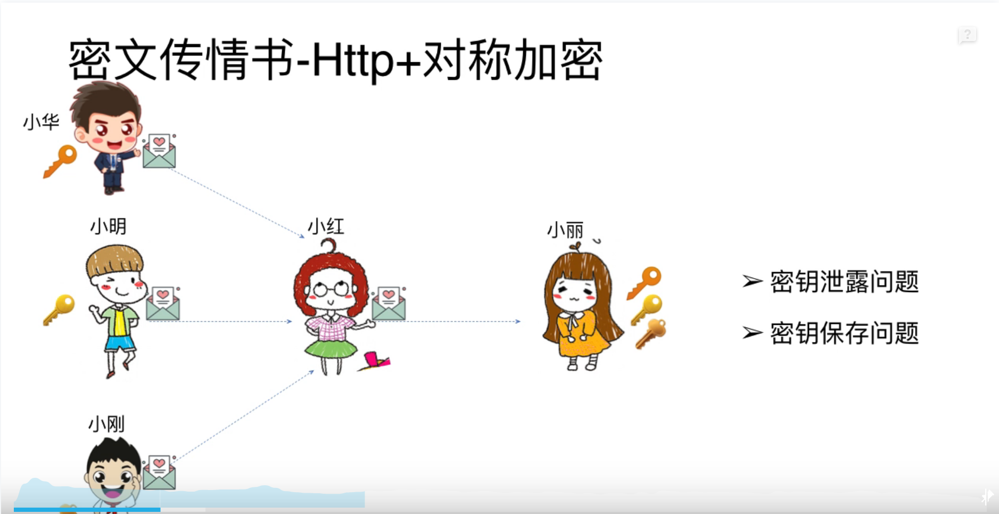
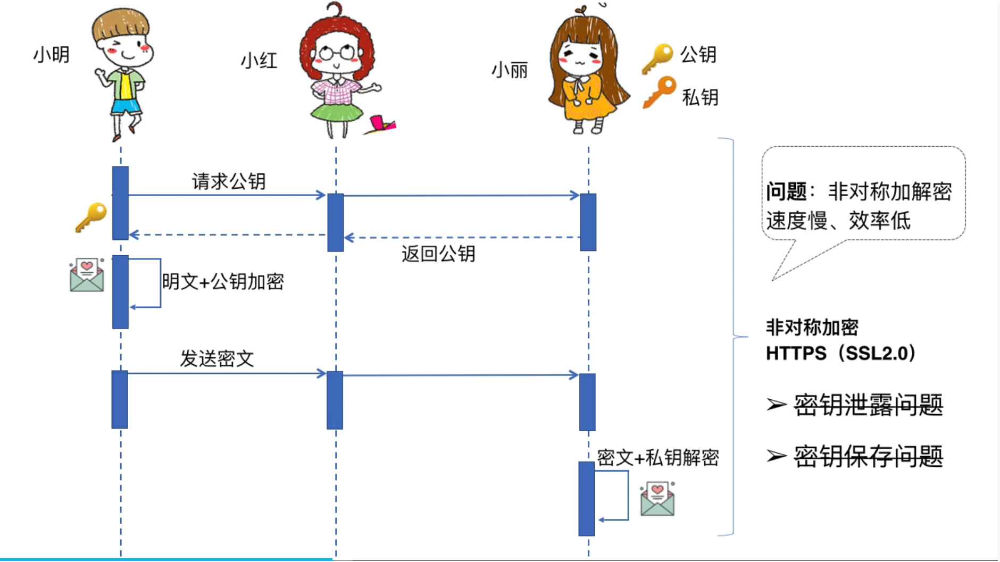
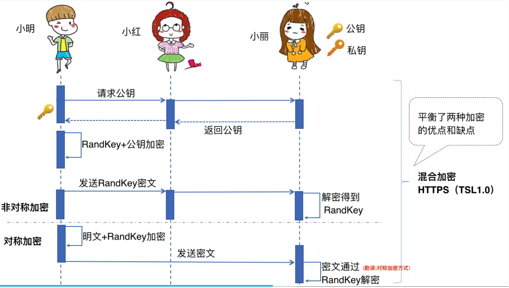
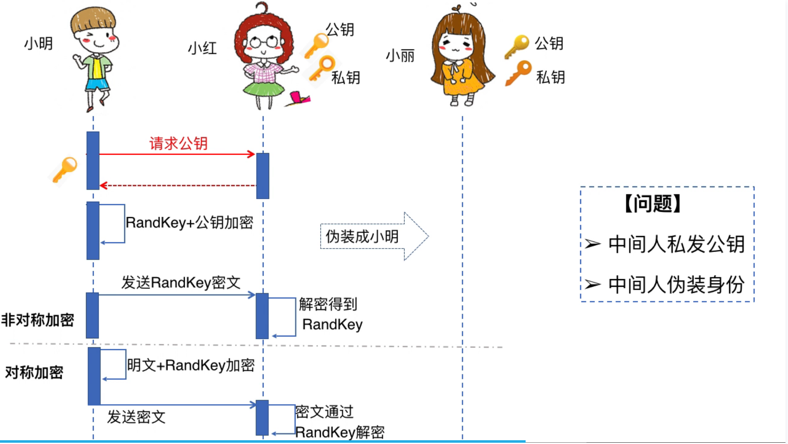
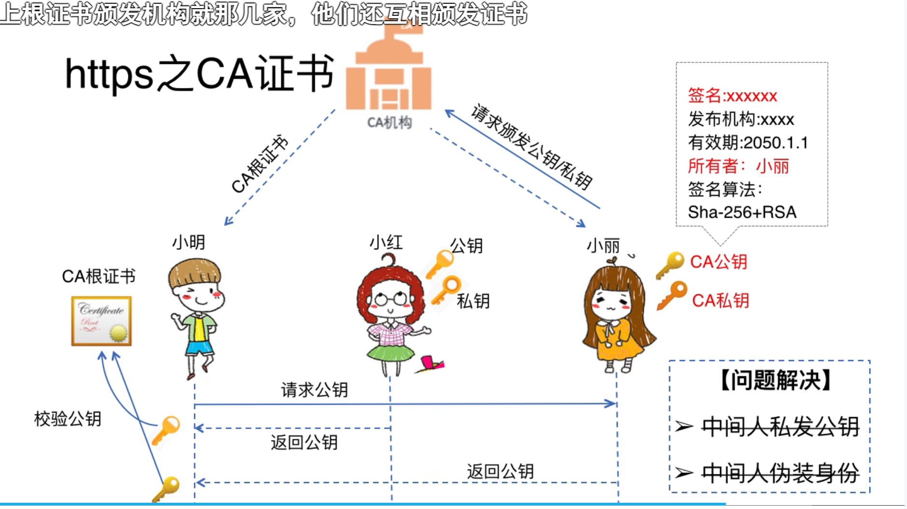
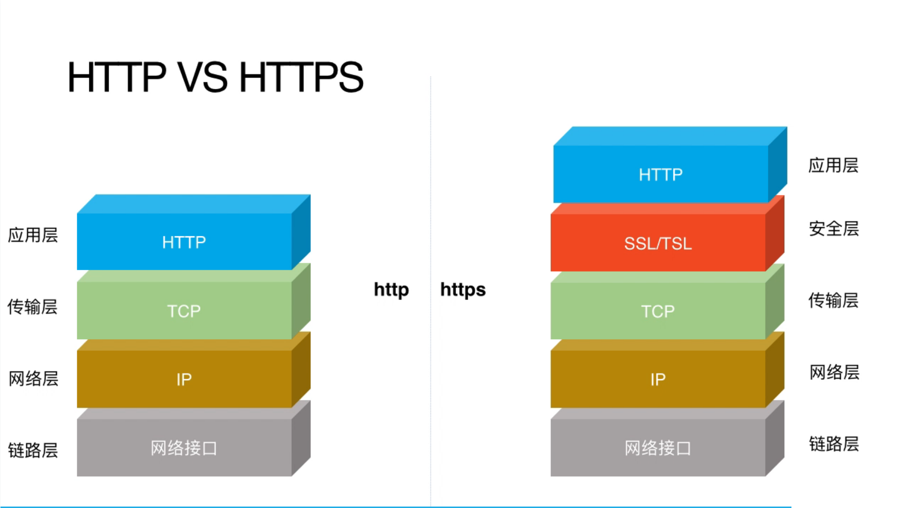
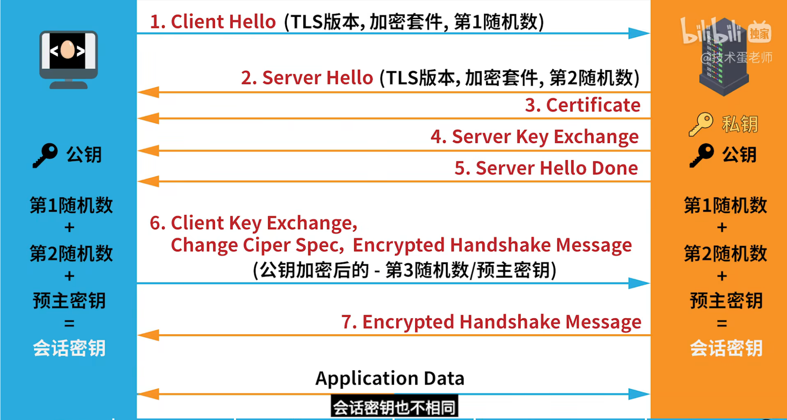

#### 一、对称加密

​		加密、解密使用相同的秘钥。

​		常见的算法：AES、ChaCha20。

​		加密、解密速度快。

#### 二、非对称加密

​		加密使用公钥、解密使用私钥。

​		常见的算法：RAS、ECC

​		加密、解密速度非常慢。

#### 三、HTTPS使用混合加密

#### 四、出现小问题（中间人伪装）

#### 五、CA证书

​		世界上所有的系统都内置了CA根证书，就那么几家。我们只需向CA机构申请公钥和私钥即可（有nginx、apache、Tomcat等等类型的公钥和私钥），将我们的网站设置之后，使用浏览器访问时地址栏就有一个小锁，点击小锁可以查看我们网站的证书。

​		当我们的网站证书被偷，被使用在别的域名上是，地址栏会显示一个大大的红叉，表示该网站的证书与域名不同，是危险网站。

#### 六、HTTP VS HTTPS

#### 七、SSL传输（深入HTTPS混合加密）获取RANDKEY时实际上更细节一些

​		1、浏览器请求服务器，首先完成3次握手建立连接。

​		2、请求公钥，此时传递浏览器生成的第1随机数。

​		3、服务器接收到第1随机数，自己也生成第2随机数，把公钥和第2随机数一起发送给浏览器。

​		4、浏览器生成预主秘钥、也就是第3随机数，然后把该第3随机数加密发送给服务器。

​		5、服务器解开第3随机数，加上前2个随机数一块使用，生成会话秘钥。浏览器也是这样。这两个会话秘钥一模一样。

​		6、以上使用了一次非对称加密，接下来所有的请求使用对称加密，这样速度快，加密也安全。

​		

