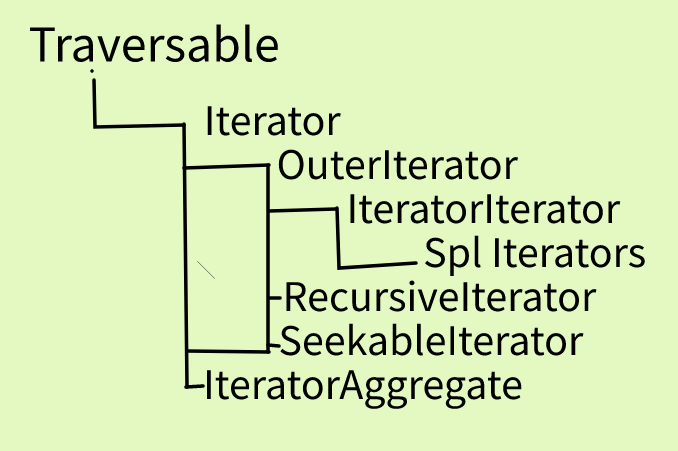

#### 一、SeekableIterator

````php
interface SeekableIterator extends Iterator
{
    // 比Iterator多实现一个方法，可以指定遍历开始的位置
    // seek(0)  类似于 rewind 重置一样
    public function seek($offset)
    {
        
    }
}

class MyArr implements SeekableIterator
{
    private $item;
    private $pos;

    public function __construct($giveArray = [])
    {
        $this->item = $giveArray;
        $this->pos  = 0;
    }

    public function valid(): bool
    {
        return isset($this->item[$this->pos]);
    }

    public function key()
    {
        return $this->pos;
    }

    public function current()
    {
        return $this->item[$this->pos];
    }

    public function next()
    {
        $this->pos++;
    }

    public function rewind()
    {
        $this->pos = 0;
    }
    
    // 比Iterator多实现一个方法，可以指定遍历开始的位置
    public function seek($offset)
    {
        $this->pos = $offset;
    }
}
````


