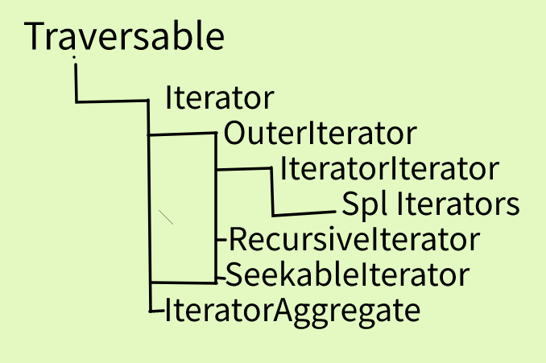

#### 一、ArrayIterator

````php
class ArrayIterator implements SeekableIterator
{
    	/* 常量 */
    	const int STD_PROP_LIST = 1;
    	const int ARRAY_AS_PROPS = 2;
    	/* 方法 */
   		public __construct(array|object $array = [], int $flags = 0)
        
        public getFlags(): int
        public setFlags(int $flags): void
    	public append(mixed $value): void
    	public getArrayCopy(): array
    	
        // 排序 
   	    public ksort(int $flags = SORT_REGULAR): bool
        public asort(int $flags = SORT_REGULAR): bool
        public uasort(callable $callback): bool
        public uksort(callable $callback): bool
        public natcasesort(): bool
        public natsort(): bool
  		
        // seekable 实现的方法
        public seek(int $offset): void
        // iterator方法
        public key(): string|int|null
    	public valid(): bool
        public next(): void
   		public current(): mixed
    	public rewind(): void
}
````

#### 二、用法

```php
$it = new ArrayIterator([1,2,3]);
foreach($it as $item){
    var_dump($item);
}

class My{
    public $a = 'a';
    public $b = 'b';
}
$it = new ArrayIterator(new My);

# 正常遍历
# 遍历一次完成之后，需要手动 $my->rewind() 将pos设置为0
foreach($it as $item){
    var_dump($item);
}


# 含义是 $my->a = 'a'，是设置在$my上边的属性
$it = new ArrayIterator([],ArrayIterator::STD_PROP_LIST);
# 含义是 $my->a = 'a'，是设置在遍历items上的属性和值（如果写的话，推荐使用这个）
$it = new ArrayIterator([],ArrayIterator::ARRAY_AS_PROP);


// 扩展自己的方法也是可以的
class MyData extends ArrayIterator
{
    public function __call($func, $argv)
    {
        if (!is_callable($func)) {
            throw new BadMethodCallException(__CLASS__ . '->' . $func);
        }
        return call_user_func_array($func, array_merge(array($this->getArrayCopy()), $argv));
    }
}

$it = new MyData([1,2,4]);
var_dump($it->array_reverse());
```

#### 三、ArrayObject

```php
// 另一种方法实现，与上边差不多，少了一个seek方法，多了一个getIterator方法
class ArrayObject implements IteratorAggregate 
{
    	/* 常量 */
    	const int STD_PROP_LIST = 1;
    	const int ARRAY_AS_PROPS = 2;
    	/* 方法 */
   		public __construct(array|object $array = [], int $flags = 0)
        
        public getFlags(): int
        public setFlags(int $flags): void
    	public append(mixed $value): void
    	public getArrayCopy(): array
    	
        // 排序 
   	    public ksort(int $flags = SORT_REGULAR): bool
        public asort(int $flags = SORT_REGULAR): bool
        public uasort(callable $callback): bool
        public uksort(callable $callback): bool
        public natcasesort(): bool
        public natsort(): bool
  		
        // iteratorAggregate方法
        public getIterator():iterator
}
```

#### 四、用法

```php

```


