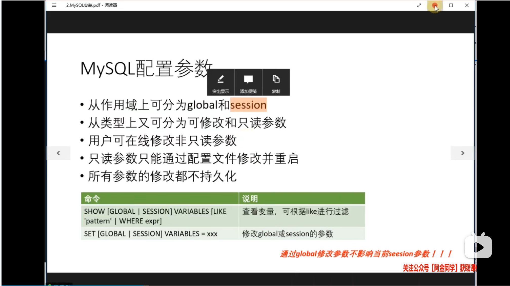
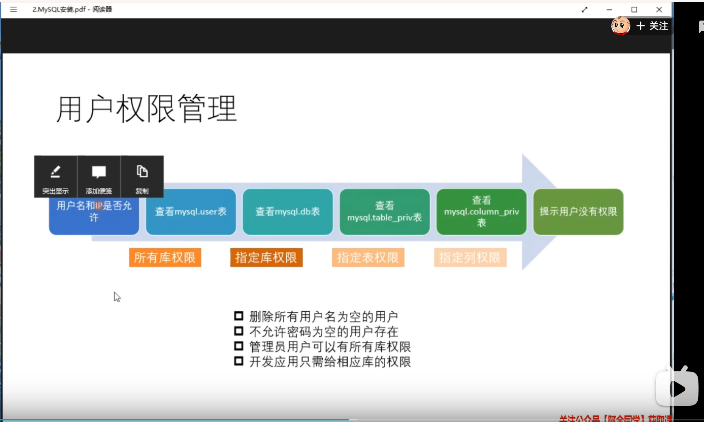
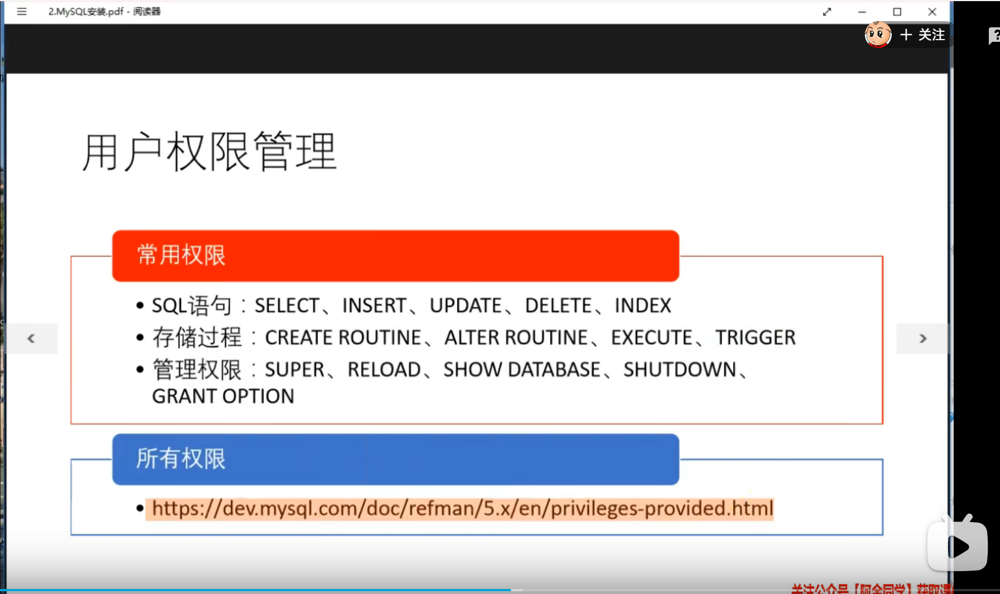
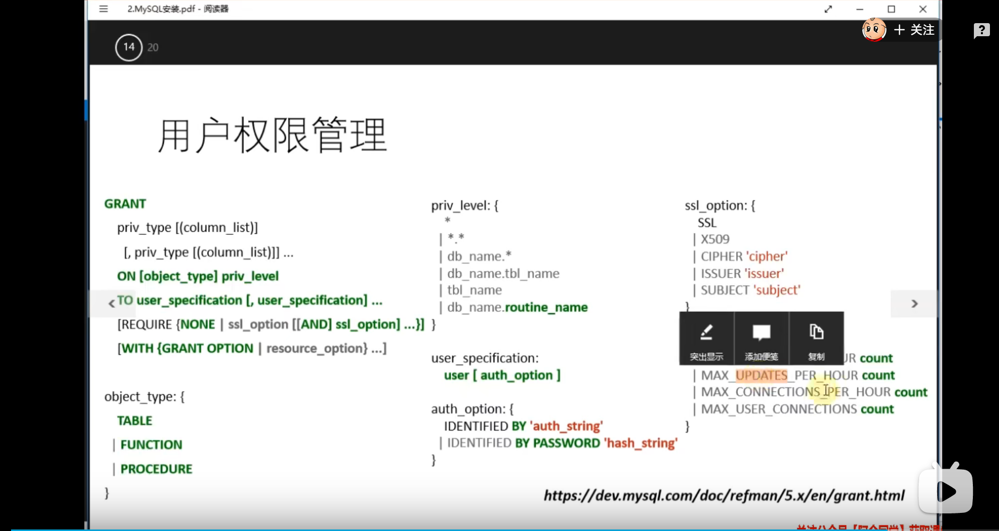

#### 一、安装相关



```shell
# 查看当前的会话的参数和全局参数
use performance_schema;
show tables like '%variable%';
# 这个只展示当前的线程ID，需要与连接ID配合才可以查看
select * from variables_by_thread where variable_name = 'long_query_time';

select connection_id();# 查看当前连接的ID

select * from threads where processlist_id = 3 \G # 查看当前连接ID对应的线程ID
```

#### 二、权限管理





```shell
# 创建用户
create user 'root'@'%' identified by '123';
create user 'root'@'%';#空密码

# 修改用户密码
alter user 'root'@'%' identified by '1111aaA_';
# 修改用户密码，不推荐直接修改库中的密码
update user set authentication_string=password('1111aaA_2222')  where user='root' and host ='%';
# 修改用户密码，用户自己修改，登录上即可
set password='1111aaA_'; # 5.7+
set password=password('1111aaA_'); # 5.6

# 删除用户
drop user root@'%';
# 删除用户，不推荐直接删除库中的用户
delete user where user='root' and host = '%';

# 权限相关
# 查看当前用户的权限
show grants;
# 查看其他人的权限
show grants for root@'192.168.%';
# 授予其他人权限，可以一直添加
grant select,update,insert,delete on test.* to root@'192.168.%';
grant create,index on test.* to root@'192.168.%';
# 收回其他人权限
revoke create,index on test.* from root@'192.168.%';
revoke all on *.* from root@'192.168.%';# 收回所有的权限
# 授予其他人有授予自己权限的权限
grant select,update,insert,delete on test.* to root@'192.168.%' with grant option;
# 刷新权限，只有直接修改权限表的时候才需要刷新，正常使用不需要刷新权限
flush privileges;

# 创建用户并且赋予权限，两条sql合并成一条，不推荐这么使用，将来就要废弃掉这种用法
grant select,update,insert,delete on *.* to root@'%' identified by 'aaA_1111';
# 查看上一条sql的报警信息
show warnings;

# user 是全局表，db是数据库级，tables_priv表级，columns_priv列级别
# 非常不建议直接修改权限表的


```

#### 三、对资源进行管理



```shell
# 用户需要ssl连接 且 最大连接数不能超过1
alter user root@'%' require ssl with max_user_connections 1;
```


