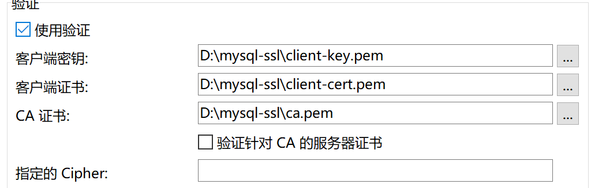

#### 一、ssl连接

```shell
# 在本地机器上是使用socket

status; # \s 查看连接的状态

mysql -uroot -p123456 -h 192.168.110.150 --ssl-mode=disabled #禁用ssl模式

mysql -uroot -p123456 -h 192.168.110.150 --ssl-mode=none #禁用ssl模式，不写则启用ssl


alter user root@'%' require ssl; # 指定用户必须使用ssl连接，如果连接的时候禁用ssl则连接不上去
alter user root@'%' require x509;# 不仅是ssl连接，还必须加上秘钥
```



#### 二、密码插件

```shell
# mysql已经启动的时候安装
INSTALL PLUGIN validate_password SONAME 'validate_password.so'; 

# 或在配置文件中加入
[mysqld]
plugin-load-add=validate_password.so


show variables like '%validate%';
+--------------------------------------+--------+
| Variable_name                        | Value  |
+--------------------------------------+--------+
| validate_password_check_user_name    | OFF    |
| validate_password_dictionary_file    |        |
| validate_password_length             | 8      |
| validate_password_mixed_case_count   | 1      |
| validate_password_number_count       | 1      |
| validate_password_policy             | MEDIUM |
| validate_password_special_char_count | 1      |
+--------------------------------------+--------+

validate_password_policy = MEDIUM # 1 密码为中等强度，有长度限制、数字限制、特殊字符限制

set global validate_password_policy = 2;# 最高强度，可以多设置一个字典，字典中的字符不能出现
set global validate_password_dictionary_file='/mdata/mysql_test_data/dict.file';
```

#### 三、多实例安装

```shell
/etc/my.cnf	

[client]
user=root
password=123456

[mysql]
prompt=(\\u@\\h) [\\d]>\\_

[mysqld]
port=3306
user=mysql
datadir=/mdata/mysql_test_data
log_error=error.log
plugin-load-add=validate_password.so#安装密码插件

[mysql_multi]
mysqld=/usr/local/mysql/bin/mysqld_safe
mysqladmin=/usr/local/mysql/bin/mysqladmin
log=/usr/local/mysql/mysqld_multi.log

#将原始的也纳入多实例管理
[mysqld100]
port=3306
datadir=/mdata/mysql_test_data
socket=/tmp/mysql.sock

[mysqld1]
port=3307
datadir=/mdata/mysql_test_data1
socket=/tmp/mysql.sock1

[mysqld2]
port=3308
datadir=/mdata/mysql_test_data2
socket=/tmp/mysql.sock2

# 将两个实例都初始化出来
mysqld --initialize --datadir=/mdata/mysql_test_data2
mysqld --initialize --datadir=/mdata/mysql_test_data2

#通过以下命令来开启多实例
mysqld_multi report # 查看多实例运行情况
mysqld_multi start 1 # 运行多实例1
mysqld_multi start 2 # 运行多实例2
mysqld_multi start # 运行多实例全部

mysqld_multi stop 1 # 停止多实例1
mysqld_multi stop 2 # 停止多实例2
mysqld_multi stop # 停止多实例全部

mysql -uroot -p'BYBlPahD.6og' -S/tmp/mysql.sock1
```

#### 四、相关命令

```shell
netstat -ntl # 查看端口监听		
```


