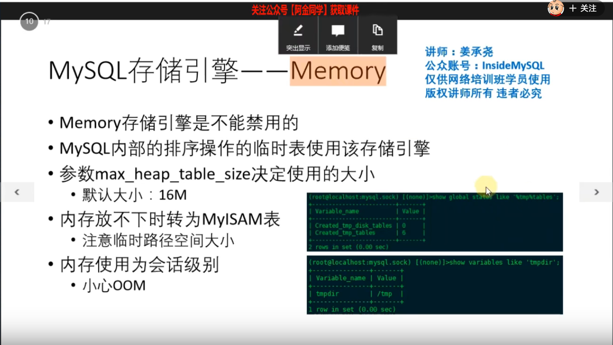

#### 一、表结构文件

```shell
# 下载辅助工具
wget https://downloads.mysql.com/archives/get/p/30/file/mysql-utilities-1.6.5.tar.gz
# 安装辅助工具
python setup.py install
# 使用辅助工具查看表文件
mysqlfrm --diagnostic user.frm --server=root:1111aaA_@localhost:3307
```

#### 二、错误日志

```shell
# 在配置文件当中自己配置
```

#### 三、慢查询日志

```shell
[client]
user=root
password=1111aaA_

[mysql]
prompt=(\\u@\\h) [\\d]>\\_

[mysqld]
port=3306
user=mysql
datadir=/mdata/mysql_test_data
log_error=error.log # 错误日志
#skip-grant-tables # 密码忘记时跳过权限验证
bind_address=192.168.110.150 # 绑定到指定地址上 *是任意地址

#################慢查询日志####################
slow_query_log=1
slow_query_log_file=slow.log
long_query_time=2
min_examined_row_limit=100 # 至少返回记录超过100行才记录
log-queries-not-using-indexes # 没有使用索引的也记录下来
log_throttle_queries_not_using_indexes = 10 # 限制每分钟记录没有使用索引的语句
log-slow-admin-statements # 记录管理操作 alter/analyze
log_output #慢日志查询的格式 file|table|none，如果为table则记录到mysql数据库的slow_log表中，不建议记录到表中，没有必要
log_slow_slave_statements # 在从服务器上开启慢查询日志
[mysqld-5.7]
log_timestamps=system #写入时区信息 5.7版本才会生效
```

```shell
# 清理慢查询日志
# 改名之后，需要去数据库中刷新一下，因为mysqld进程已经打开文件句柄了
mv slow.log slow.log.20220309
flush slow logs;

# 如果是显式加锁的话，及时执行再慢也不会记录到慢查询当中
# 当前会话
begin;
select * from user where id = 1 for update;
# 另一个会话
update user set username='' where id = 1;


# query_time - lock_time的时间，才是慢查询所需要的时间
# query_time sql语句执行的时间

```

#### 四、通用日志

```shell
#################通用日志####################
# 任何sql语句都会记录下来，一般不会开
general_log = 1;
general_log_file=general.log;

log_output=table # 如果开启这个，会把慢查询日志和通用日志都记录下来，性能下降50%
```

#### 五、MySQL存储引擎，非innodb

````shell
[mysqld]
#######################engines#####################################
federated # 开启这个存储引擎，它是默认关闭的
skip-federated # 禁用这些存储引擎
skip-archive
skip-blackhole
````

```shell
show engines; # 查看数据库支持的存储引擎

show table status;# 查看表的信息

alter table user engine = innodb;# 将表的引擎修改为innodb
```





