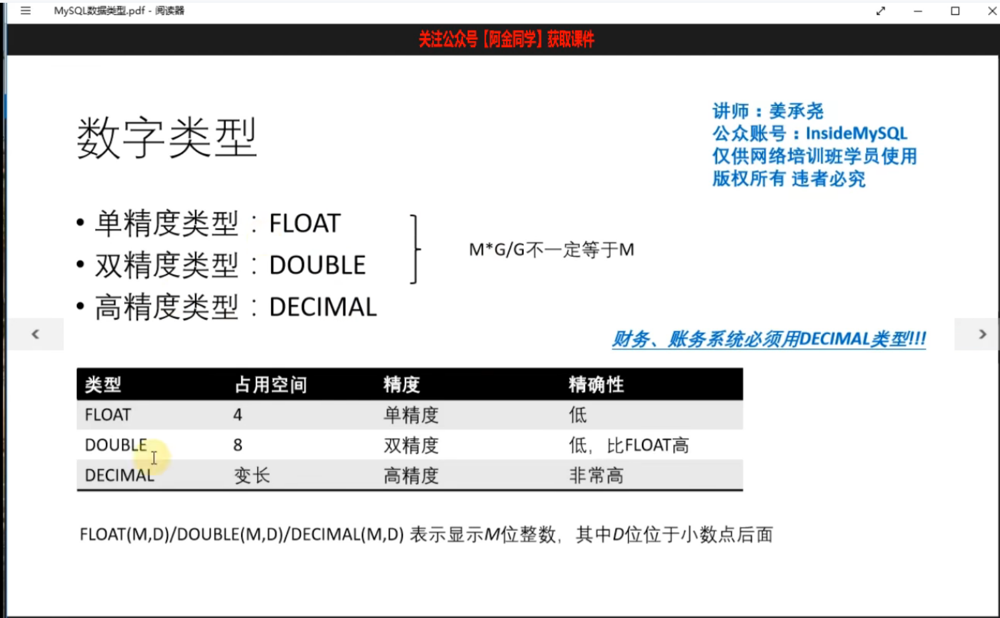
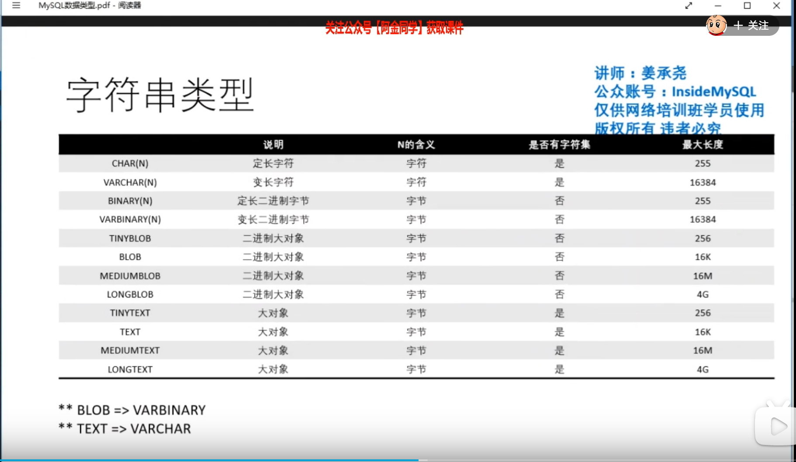
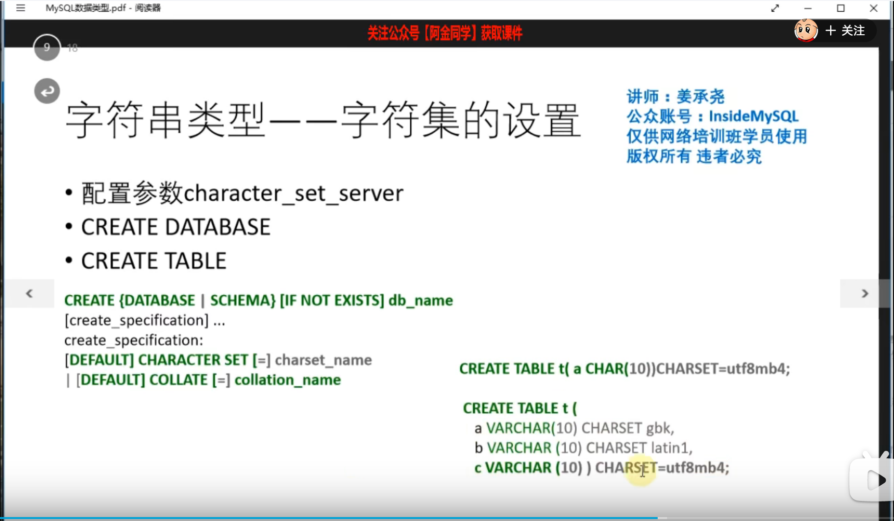
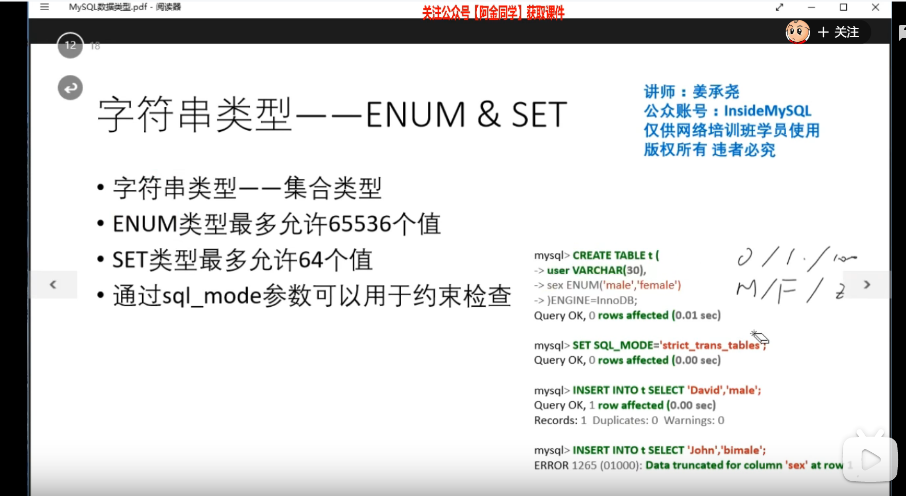
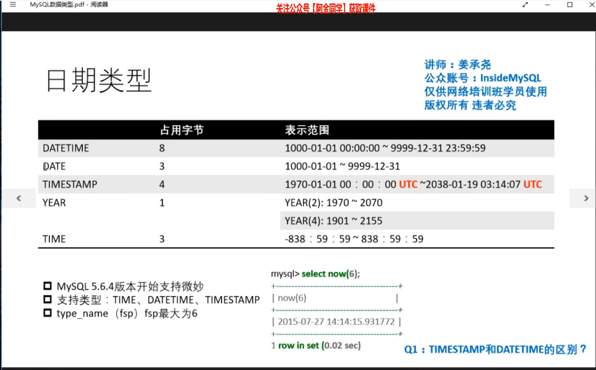
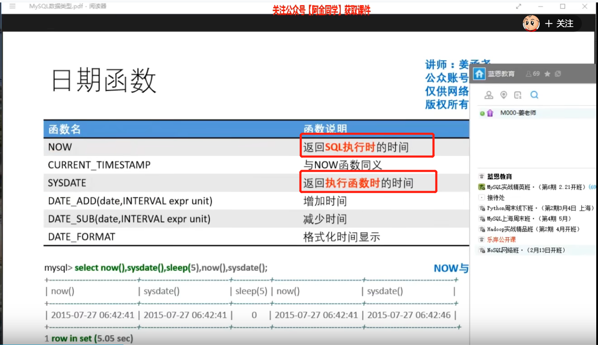
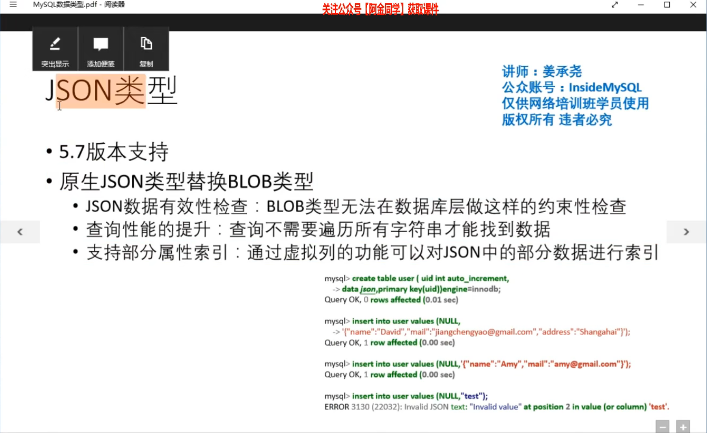
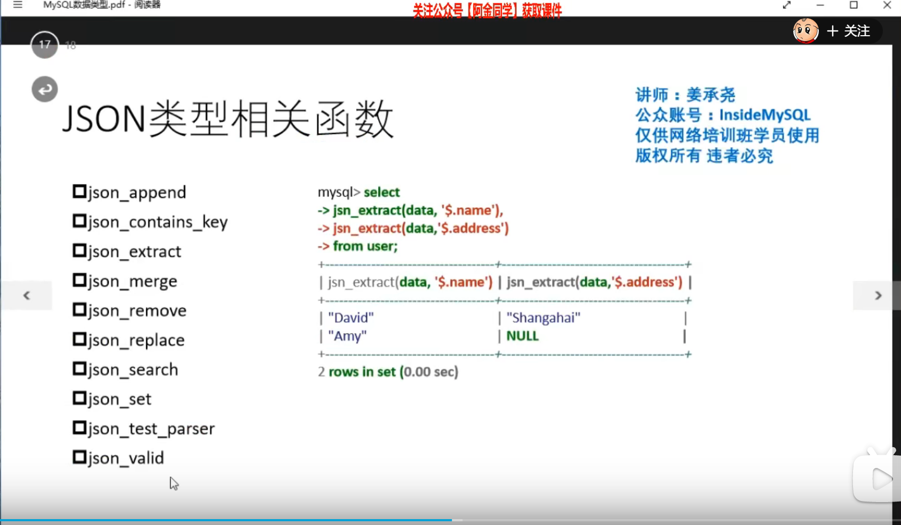

#### 一、数据类型

```shell
# 表补全功能，有时候比较卡
[mysql]
no-auto-rehash
```

```shell
# int 类型
# 推荐使用bigint类型，这个一辈子都用不完
# 使用默认的有符号类型，无符号类型出现一些不可知的错误
create table z(id bigint auto_increment primary key);
# auto_increment 每次重启会重新计算，mysql8.0已经解决这个问题，这个自增值会持久化
select max(id) from user;
```



```shell
select floor(i+rand()(j-i+1)) # 获取[i,j]的随机数
```



```shell
# length字节长度，我是3个字节
# char_length字符长度，有多少个字符，我有1个字符
select length('我'),char_length('我');

# 配置文件中设置这个
[client]
default_character_set=utf8mb4
[mysql]
default_character_set=utf8mb4
[mysqld]
character_set_server=utf8mb4


# 字符集转换 老的列也会给你转成utf8mb4
alter table z convert to character set utf8mb4;
# 字符集转换 这个有点问题，新增的列会变，但老的不变
alter table z charset=utf8mb4 
 
# 查看当前数据库支持的字符集
show charset;

# 修改数据库的字符串
```



```shell
# 查看字符的对应的编码 # 查看转换之后对应的字符编码
select hex('我');

# 转换字符串，将字符串转成对应的编码
select cast(123 as char(10));
# 查看转换之后对应的字符编码 CED2
select hex(cast('我' as char(1) charset gbk));


# char varchar 字符集概念，会校验插入的字符
# binary varbinary 没有字符集的概念，随意插入
```


```shell
# 字符串比较规则
# 一般不区分大小写，除非你有特殊的要求
# utf8mb4_general_ci 不区分大小写
# utf8mb4_bin 区分大小写
create table t(a varchar(10) collate utf8mb4_bin,unique key(a));

select md5('abc');
select concat('a','b','c');
select concat_ws('.','a','b','c');
select repeat('a',floor(1+rand()*100));

```



```shell
# 枚举类型 数据非常干净只能有这两个固定的值
sex enum('male','female');
```





```shell
timestamp # 有时区范围
datetime # 没有时区范围

set time_zone = '+0:00';
select date1,date2;

# 加上小数后边的秒数
select now(6);

# sysdate执行到我这个函数的时间
select now(6),sysdate(6);

# 时间加减
select date_add(now(),interval 1 day);
select date_add(now(),interval -1 hour);

select date_format(now(),'%Y-%m-%d');
```





```shell
create table user(id bigint auto_increment primary key,data json);

# 获取json的某个字段
select id,json_extract(data,'$.name') from user;
select id,data->'$.name' from user;
# 获取json的某个字段，去除双引号
select id,json_unquote(json_extract) from user;
select id,data->>'$.name' from user;
```

#### 二、表


#### 三、


