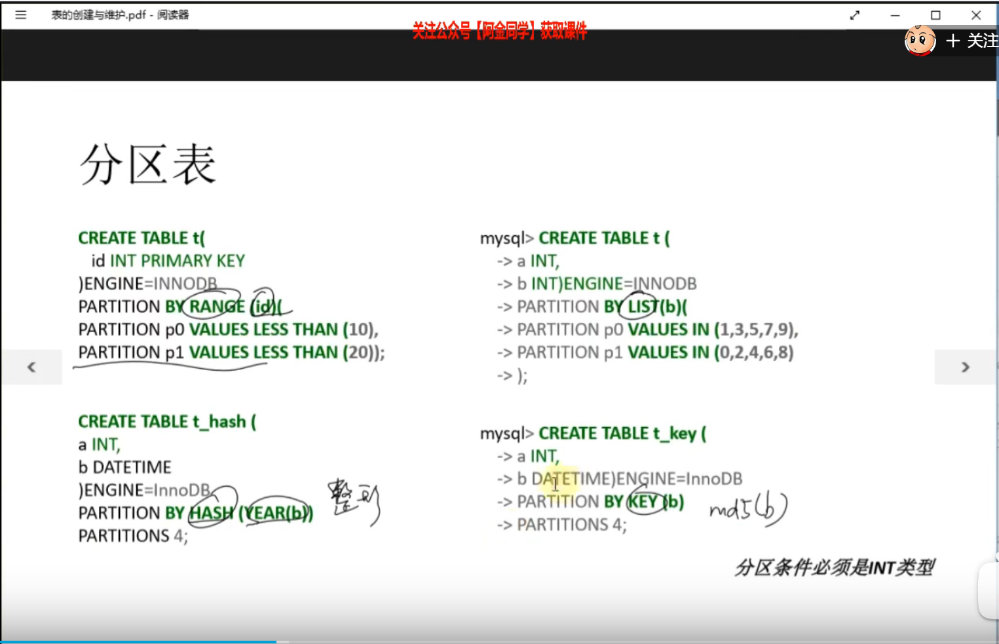
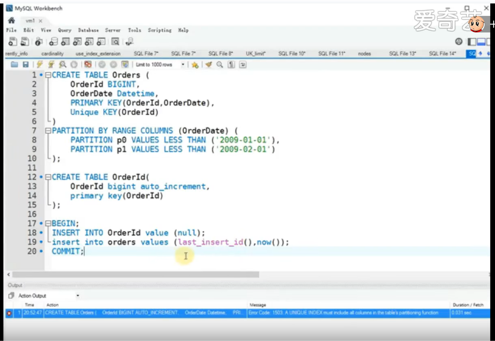
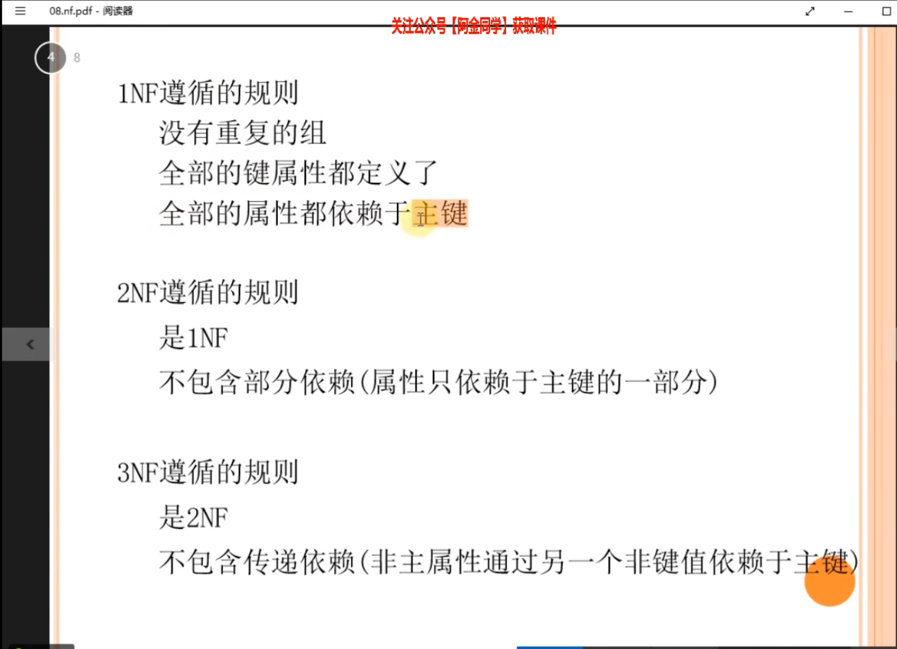

#### 一、分区



#### 



```shell
# 分表
# 1、分区的字段，必须是主键的一部分，
# 2、联合主键的话，有可能ID不唯一，此时有两种解决方法
# 第一、使用uuid，获取全局唯一主键
# 第二、多创建一个表，用来专门保存主键自增
```

#### 二、范式



#### 

```shell
# 范式 
# 1必须要有主键
# 2不包含部分依赖
# 3不包含传递依赖
```


