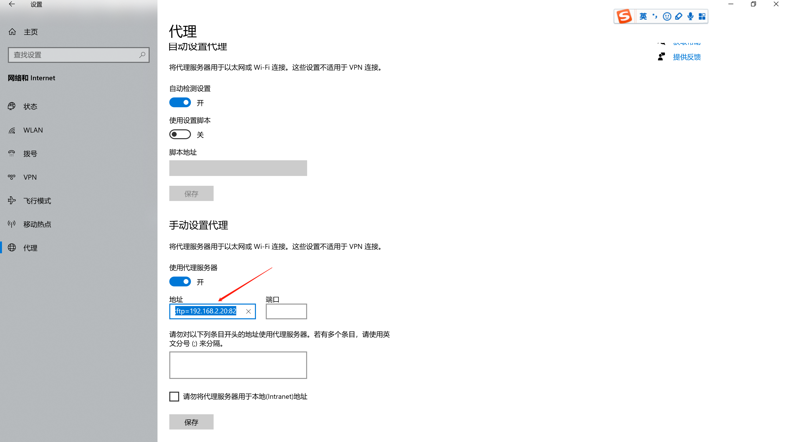
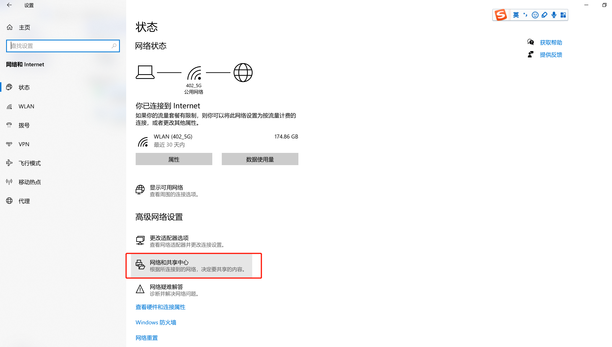
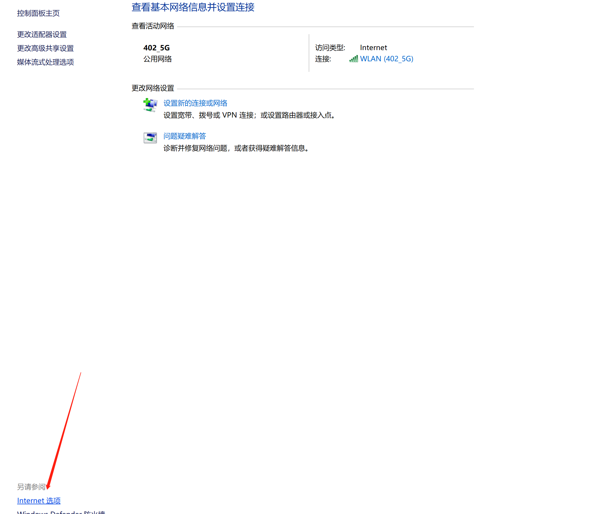
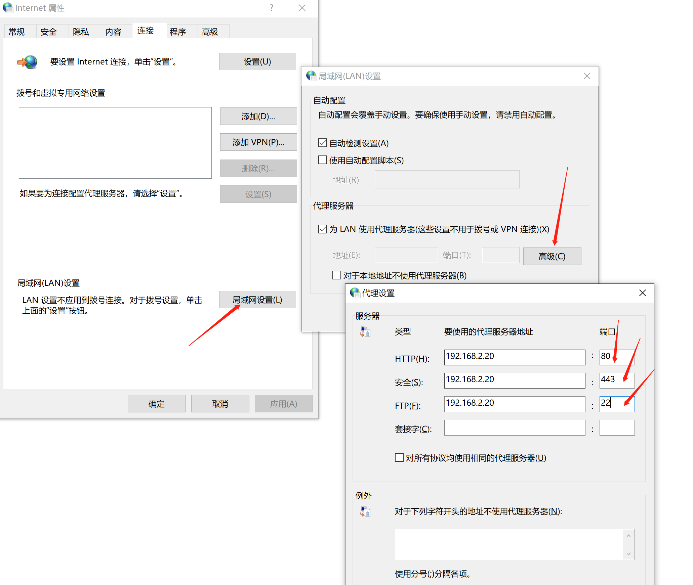

#### 一、下载nginx代理模块

```shell
git clone https://github.com/chobits/ngx_http_proxy_connect_module.git

# 以防丢失，百度网盘存一份

```

#### 二、安装

```shell
cd /root/nginx/core

git clone https://github.com/chobits/ngx_http_proxy_connect_module.git

wget http://nginx.org/download/nginx-1.16.1.tar.gz

tar -zxvf nginx-1.16.1.tar.gz

cd nginx-1.16.1

# 执行这个补丁命令 根据以下表格对应版本
patch -p1 < /root/nginx/core/ngx_http_proxy_connect_module/patch/proxy_connect_rewrite_101504.patch

# 配置上这个模块，准备安装
./configure --prefix=/usr/local/nginx --with-http_stub_status_module --with-http_ssl_module --add-module=/root/nginx/core/ngx_http_proxy_connect_module

make && make install
```

| nginx version   | enable REWRITE phase | patch                                                        |
| --------------- | -------------------- | ------------------------------------------------------------ |
| 1.4.x ~ 1.12.x  | NO                   | [proxy_connect.patch](https://github.com/chobits/ngx_http_proxy_connect_module/blob/master/patch/proxy_connect.patch) |
| 1.4.x ~ 1.12.x  | YES                  | [proxy_connect_rewrite.patch](https://github.com/chobits/ngx_http_proxy_connect_module/blob/master/patch/proxy_connect_rewrite.patch) |
| 1.13.x ~ 1.14.x | NO                   | [proxy_connect_1014.patch](https://github.com/chobits/ngx_http_proxy_connect_module/blob/master/patch/proxy_connect_1014.patch) |
| 1.13.x ~ 1.14.x | YES                  | [proxy_connect_rewrite_1014.patch](https://github.com/chobits/ngx_http_proxy_connect_module/blob/master/patch/proxy_connect_rewrite_1014.patch) |
| 1.15.2          | YES                  | [proxy_connect_rewrite_1015.patch](https://github.com/chobits/ngx_http_proxy_connect_module/blob/master/patch/proxy_connect_rewrite_1015.patch) |
| 1.15.4 ~ 1.16.x | YES                  | [proxy_connect_rewrite_101504.patch](https://github.com/chobits/ngx_http_proxy_connect_module/blob/master/patch/proxy_connect_rewrite_101504.patch) |
| 1.17.x ~ 1.18.0 | YES                  | [proxy_connect_rewrite_1018.patch](https://github.com/chobits/ngx_http_proxy_connect_module/blob/master/patch/proxy_connect_rewrite_1018.patch) |
| 1.19.x ~ 1.21.0 | YES                  | [proxy_connect_rewrite_1018.patch](https://github.com/chobits/ngx_http_proxy_connect_module/blob/master/patch/proxy_connect_rewrite_1018.patch) |
| 1.21.1          | YES                  | [proxy_connect_rewrite_102101.patch](https://github.com/chobits/ngx_http_proxy_connect_module/blob/master/patch/proxy_connect_rewrite_102101.patch) |

#### 三、配置

```nginx
worker_processes  1;
events {
    worker_connections  1024;
}
http {
    include       mime.types;
    default_type  application/octet-stream;

    log_format  main  '$remote_addr - $remote_user [$time_local] "$request" '
                      '$status $body_bytes_sent "$http_referer" '
                      '"$http_user_agent" "$http_x_forwarded_for"';
    access_log  logs/access.log  main;

    sendfile        on;
    keepalive_timeout  65;
	
    # 不需配置域名，它只是用来代理的
    # 需要配置resolver，DNS用来解析代理域名
    server {
        listen       80;
	    resolver 8.8.8.8;
        location / {
            root   html;
            index  index.html index.htm;
		   proxy_pass http://$host$request_uri;
        }
        error_page   500 502 503 504  /50x.html;
        location = /50x.html {
            root   html;
        }
    }
    server {
        # 不需要使用ssl，只是用来代理异一下
        # listen 443 ssl;
         listen  443;
		resolver 8.8.8.8;
		proxy_connect;
		proxy_connect_allow 443 563;
		proxy_connect_connect_timeout 10s;
		proxy_connect_read_timeout 10s;
		proxy_connect_send_timeout 10s;
        location / {
            root   html;
            index  index.html index.htm;
        	proxy_pass $scheme://$http_host$request_uri;
		}
    }

}

```

#### 四、使用



```sh
# 里边写入代理服务器的IP和端口
http=192.168.2.20:80;https=192.168.2.20:443;ftp=192.168.2.20:22
```

或使用下边的方式设置，其实都一样









