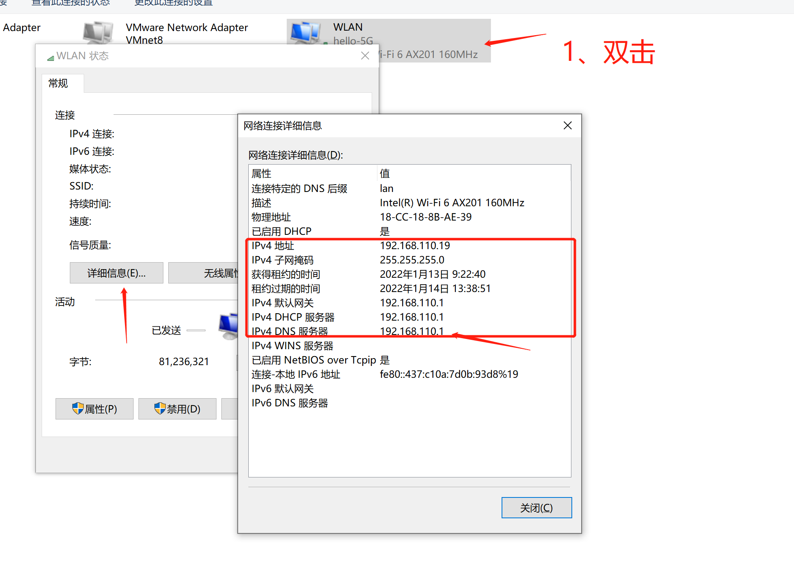
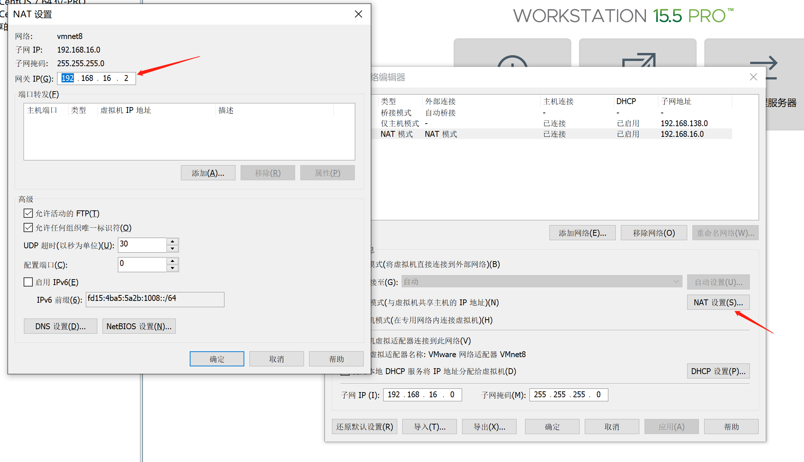
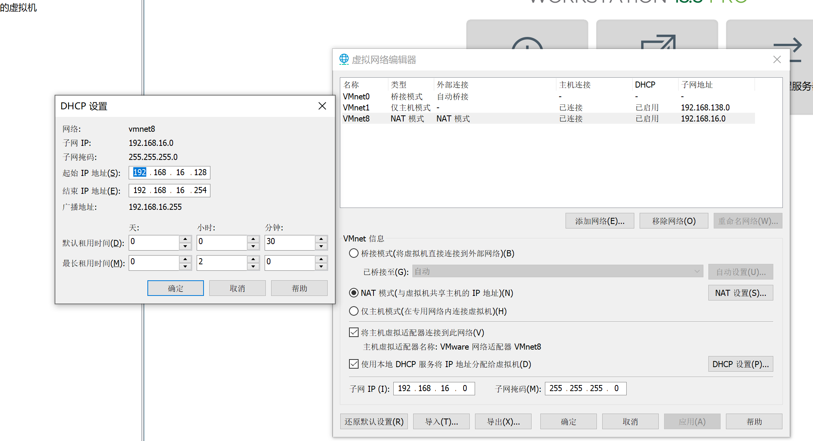
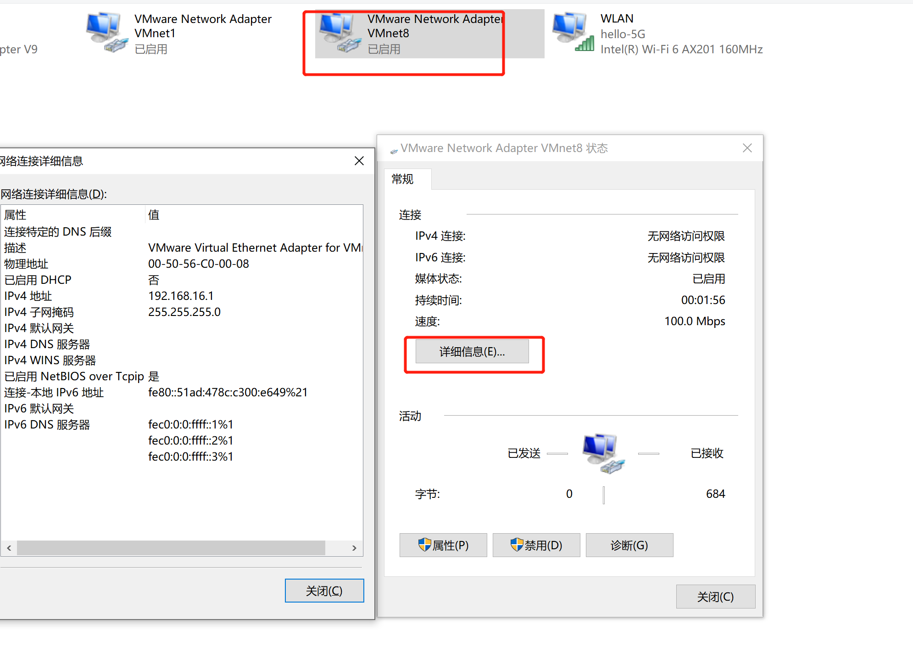
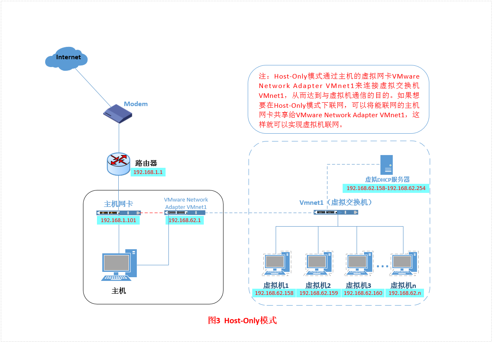
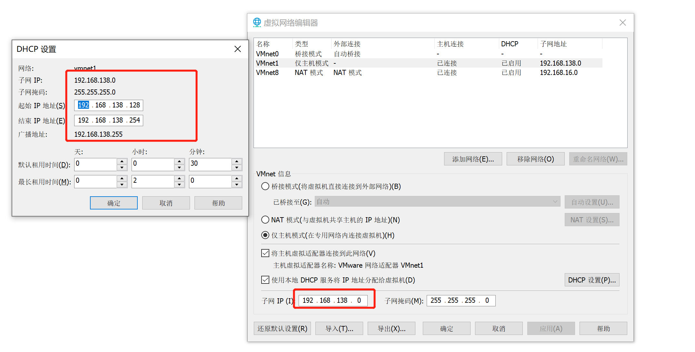
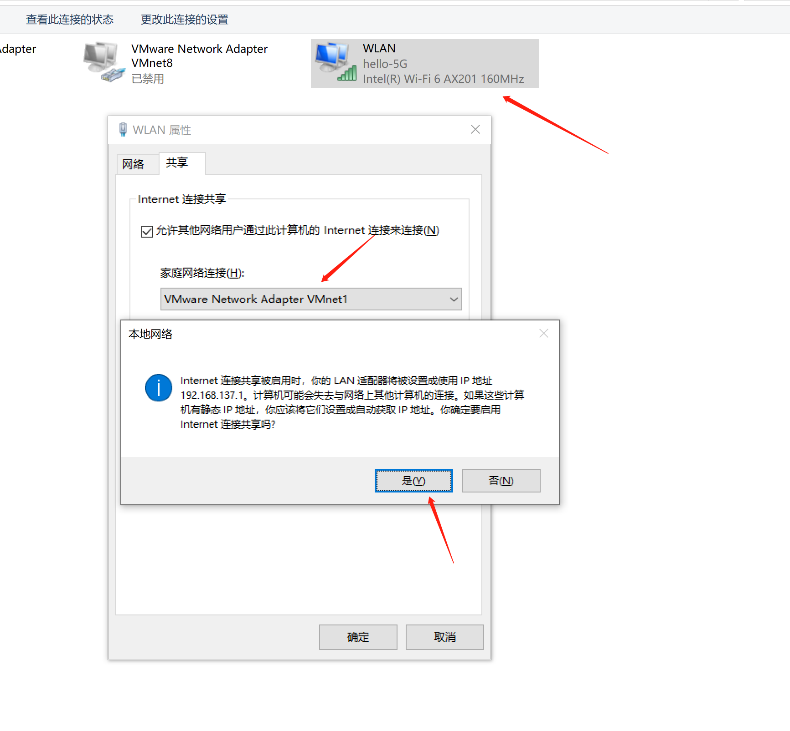
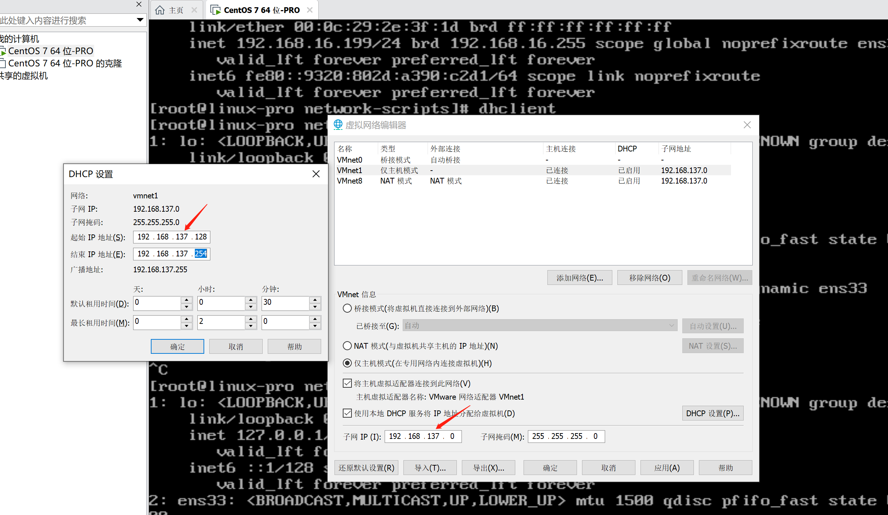

#### 零、查看主机的网络信息



#### 一、桥接模式

##### 1、原理介绍

​		最简单的模式，只需一些简单设置即可，联网或与本机互联。适用于IP资源丰富的场景。下图为原理图。


##### 2、具体设置

1. 把虚拟机的网络适配器设置为桥接模式。

2. 修改虚拟机的网卡配置即可。

   ```shell
   [root@linux-pro ~]# cat /etc/sysconfig/network-scripts/ifcfg-ens33
   TYPE="Ethernet"
   PROXY_METHOD="none"
   BROWSER_ONLY="no"
   BOOTPROTO="dhcp" # dhcp 是动态获取IP地址
   #BOOTPROTO="static" # static 是使用静态地址
   #IPADDR=192.168.110.199 # 192.168.110.x 与主机同一个网段
   #NETMASK=255.255.255.0 # 255.255.255.0 与主机同一个子网掩码
   #GATEWAY=192.168.110.1 # 192.168.110.1 与主机同一个路由网关
   #DNS1=192.168.110.1 # 192.168.110.1 DNS1 就是主机的路由网关
   DEFROUTE="yes"
   IPV4_FAILURE_FATAL="no"
   IPV6INIT="yes"
   IPV6_AUTOCONF="yes"
   IPV6_DEFROUTE="yes"
   IPV6_FAILURE_FATAL="no"
   IPV6_ADDR_GEN_MODE="stable-privacy"
   NAME="ens33"
   UUID="9602b90f-9332-47d1-940b-f61a3015cdbf"
   DEVICE="ens33"
   ONBOOT="yes"
   ```

#### 二、NAT模式

##### 1、原理

​		借助NAT设备，通过主机的网卡连接互联网。借助VMware Network Adapter VMnet8网卡，把这个网卡当做路由器与虚拟机链接，有些许复杂。


##### 2、具体配置







- 将虚拟机的网络设置修改如上图所示，此时不需要动VMware Network Adapter VMnet8网卡，它会自动设置为192.168.16.1，它用来与虚拟机通信。

  ```shell
  [root@linux-pro ~]# cat /etc/sysconfig/network-scripts/ifcfg-ens33
  TYPE="Ethernet"
  PROXY_METHOD="none"
  BROWSER_ONLY="no"
  #BOOTPROTO="dhcp" # 动态获取IP地址，不需要使用下边的
  BOOTPROTO="static" # 静态IP
  IPADDR=192.168.16.199 # 自己在上图设置的IP地址，需要在范围之内
  NETMASK=255.255.255.0 # 子网掩码，与上图显示的一致
  GATEWAY=192.168.16.2 # 网关，与上图显示的一致
  DNS1=192.168.16.2 # DNS1，与网关的一致
  DEFROUTE="yes"
  IPV4_FAILURE_FATAL="no"
  IPV6INIT="yes"
  IPV6_AUTOCONF="yes"
  IPV6_DEFROUTE="yes"
  IPV6_FAILURE_FATAL="no"
  IPV6_ADDR_GEN_MODE="stable-privacy"
  NAME="ens33"
  UUID="9602b90f-9332-47d1-940b-f61a3015cdbf"
  DEVICE="ens33"
  ONBOOT="yes"
  ```

#### 三、主机模式

##### 1、原理

​	该模式只与主机互联，通过VMware Network Adapter VMnet1实现的，不能上网，但是可以通过一定的手段让它可以上网。其实就是去掉NAT设备的NAT模式。



##### 2、具体设置



```shell
[root@linux-pro ~]# cat /etc/sysconfig/network-scripts/ifcfg-ens33
TYPE="Ethernet"
PROXY_METHOD="none"
BROWSER_ONLY="no"
#BOOTPROTO="dhcp"
BOOTPROTO="static"
IPADDR=192.168.138.199 # 由于不需要上网，也就没有网关和DNS1
NETMASK=255.255.255.0 # 只有IP和子网掩码，不需要网关和DNS1
#GATEWAY=192.168.138.2
#DNS1=192.168.138.2
DEFROUTE="yes"
IPV4_FAILURE_FATAL="no"
IPV6INIT="yes"
IPV6_AUTOCONF="yes"
IPV6_DEFROUTE="yes"
IPV6_FAILURE_FATAL="no"
IPV6_ADDR_GEN_MODE="stable-privacy"
NAME="ens33"
UUID="9602b90f-9332-47d1-940b-f61a3015cdbf"
DEVICE="ens33"
ONBOOT="yes"
```

如果想让他上网，那么需要额外的设置，把主机的网络共享给他，那么其他的也需要设置一下。





```shell
[root@linux-pro ~]# cat /etc/sysconfig/network-scripts/ifcfg-ens33
TYPE="Ethernet"
PROXY_METHOD="none"
BROWSER_ONLY="no"
#BOOTPROTO="static"  # 静态IP设置
#IPADDR=192.168.137.199 # 设置为共享网卡的IP网段
#NETMASK=255.255.255.0 # 掩码不变
#GATEWAY=192.168.137.1 # 网关设置为 VMware Network Adapter VMnet1 的IP
#DNS1=192.168.137.1 # DNS1 设置为 VMware Network Adapter VMnet1 的IP

BOOTPROTO="dhcp" # 静态IP设置
GATEWAY=192.168.137.1 # 静态IP设置需要配置网关 网关设置为 VMware Network Adapter VMnet1 的IP
DNS1=192.168.137.1 # 静态IP设置需要配置DNS1  DNS1设置为 VMware Network Adapter VMnet1 的IP
NM_CONTROLLED=no # 有些小问题，需要去除networkmanager的影响 或者 重启网卡之后 再 dhclient 重新获取动态IP即可
# dhclient -r 释放当前的IP 
# dhclient 直接运行 重新获取IP
DEFROUTE="yes"
IPV4_FAILURE_FATAL="no"
IPV6INIT="yes"
IPV6_AUTOCONF="yes"
IPV6_DEFROUTE="yes"
IPV6_FAILURE_FATAL="no"
IPV6_ADDR_GEN_MODE="stable-privacy"
NAME="ens33"
UUID="9602b90f-9332-47d1-940b-f61a3015cdbf"
DEVICE="ens33"
ONBOOT="yes"
```


