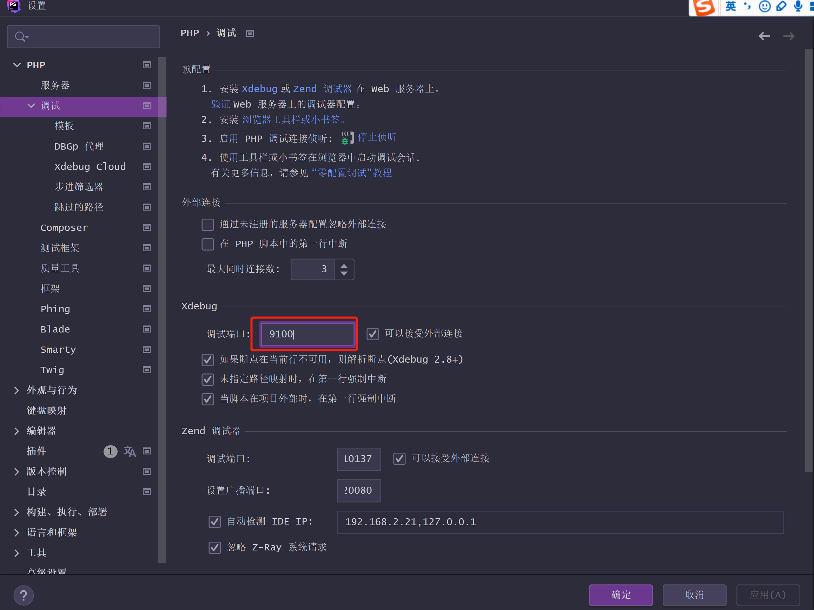
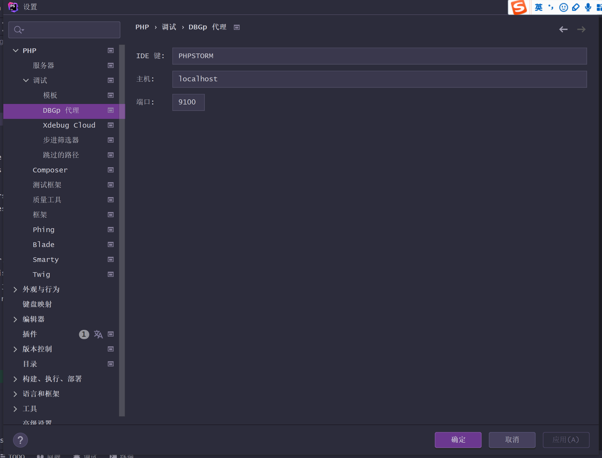
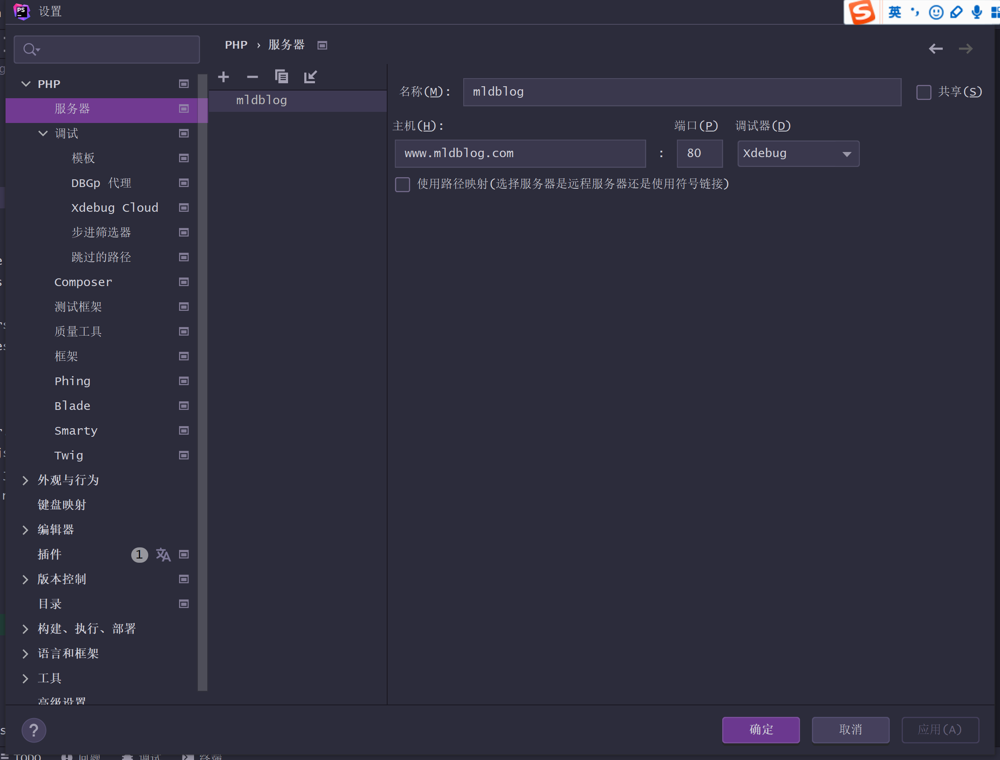
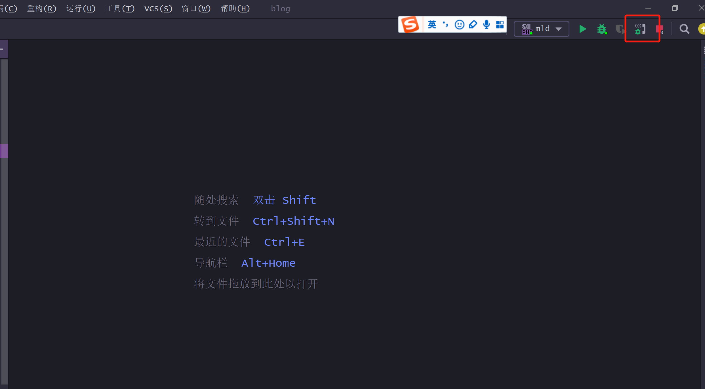
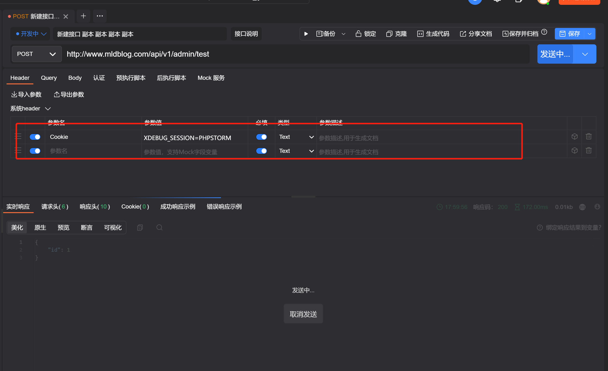

```ini
# 一定要注意细节，各个细节都要配置正确
[Xdebug]
zend_extension=D:/phpstudy_pro/Extensions/php/php8.0.2nts/ext/php_xdebug.dll
xdebug.collect_params=1
xdebug.collect_return=1
xdebug.auto_trace=Off
xdebug.trace_output_dir=D:/phpstudy_pro/Extensions/php_log/php8.0.2nts.xdebug.trace
xdebug.profiler_enable=Off
xdebug.profiler_output_dir=D:/phpstudy_pro/Extensions/php_log/php8.0.2nts.xdebug.profiler
xdebug.mode=debug
xdebug.remote_mode=req
xdebug.remote_enable=1
xdebug.remote_autostart = 1
xdebug.remote_host=www.mldblog.com
xdebug.remote_port=9100
xdebug.client_port=9100
xdebug.idekey=PHPSTORM
xdebug.remote_handler=dbgp
```

### 细节一定要配置正确








### 不要忘记开启使用



#### 使用时

​	如果是接口工具需要配置header头，Cookie=XDEBUG_SESSION=PHPSTORM。

​	如果是浏览器，那么可以直接访问。如果浏览器访问不了，查看Cookie是否设置正确。




