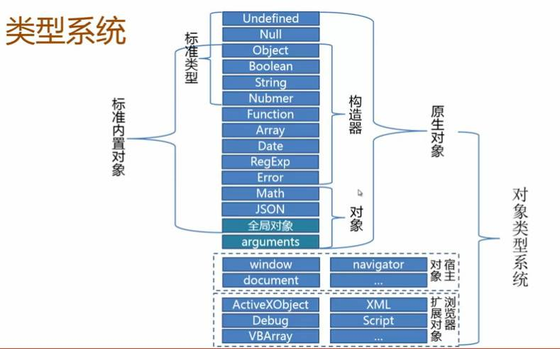

#### 一、JS数据类型系统

1. 包含原生对象类型（15种）、宿主对象类型（window对象的属性）、浏览器扩展类型。

2. 15种原生对象类型，包含2大类：原始类型和对象类型。

   ​	原始类型又分为2类：

   ​			一类是空值（2种，undefined和null）

   ​			一类是包装对象（3种，Boolean、Number和String）

   ​	对象类型也分为2类：

   ​			一类是构造器对象（6种，Object、Function、Date、Array、Error和RegExp）

   ​			一类是单体内置对象（4种，Math、JSON、全局对象和arguments）（不实例化，在特定环境中直接使用即可）

3. 15种原生对象类型，包含2大类：原始类型和引用类型。

   ​	原始类型又叫基本类型、简单类型

   ​		 共有5种，undefined、null、boolean、number、string

   ​    引用类型又叫对象类型、复杂类型

   ​		共有10种，object、function、date、array，error、regexp、math、json、全局对象、arguments

   ​    注意注意：

   ​		原始类型中的boolean、number、string，其实是变种的引用类型，也是对象类型的一种，是可以使用对象的属性和方法。

4. 全局对象是什么？

   - 这是一个概念性的对象，并不是实际存在的对象，从某种意义上讲，它是一个终极的“兜底儿对象”，就是不属于任何其他对象的属性和方法，最终都是它的属性和方法。

   - 因为它是对象不是类，所以不能实例化出来一个新的对象。

   - 它是全局对象，在任何地方都可以访问它，也可以在任何地方使用它的属性和方法。

   - 在顶层的js代码中，this引用这个对象，可以访问它、使用它的属性和方法。

   - 在客户端的js中，window对象实现了这个全局对象的一部分，也可以说window对象就是客户端js中的全局对象。

   - 因为是全局对象且不存在，访问它的属性和方法，直接写就行了，不需要加.来访问。

     #### 常见的全局对象方法

     | 函数                                                         | 描述                                               |
     | :----------------------------------------------------------- | :------------------------------------------------- |
     | [decodeURI()](https://www.w3school.com.cn/jsref/jsref_decodeURI.asp) | 解码某个编码的 URI。                               |
     | [decodeURIComponent()](https://www.w3school.com.cn/jsref/jsref_decodeURIComponent.asp) | 解码一个编码的 URI 组件。                          |
     | [encodeURI()](https://www.w3school.com.cn/jsref/jsref_encodeuri.asp) | 把字符串编码为 URI。                               |
     | [encodeURIComponent()](https://www.w3school.com.cn/jsref/jsref_encodeURIComponent.asp) | 把字符串编码为 URI 组件。                          |
     | [escape()](https://www.w3school.com.cn/jsref/jsref_escape.asp) | 对字符串进行编码。                                 |
     | [eval()](https://www.w3school.com.cn/jsref/jsref_eval.asp)   | 计算 JavaScript 字符串，并把它作为脚本代码来执行。 |
     | [getClass()](https://www.w3school.com.cn/jsref/jsref_getClass.asp) | 返回一个 JavaObject 的 JavaClass。                 |
     | [isFinite()](https://www.w3school.com.cn/jsref/jsref_isFinite.asp) | 检查某个值是否为有穷大的数。                       |
     | [isNaN()](https://www.w3school.com.cn/jsref/jsref_isNaN.asp) | 检查某个值是否是数字。                             |
     | [Number()](https://www.w3school.com.cn/jsref/jsref_number.asp) | 把对象的值转换为数字。                             |
     | [parseFloat()](https://www.w3school.com.cn/jsref/jsref_parseFloat.asp) | 解析一个字符串并返回一个浮点数。                   |
     | [parseInt()](https://www.w3school.com.cn/jsref/jsref_parseInt.asp) | 解析一个字符串并返回一个整数。                     |
     | [String()](https://www.w3school.com.cn/jsref/jsref_string.asp) | 把对象的值转换为字符串。                           |
     | [unescape()](https://www.w3school.com.cn/jsref/jsref_unescape.asp) | 对由 escape() 编码的字符串进行解码。               |

     #### 常见的全局对象属性

     | 方法                                                         | 描述                                   |
     | :----------------------------------------------------------- | :------------------------------------- |
     | [Infinity](https://www.w3school.com.cn/jsref/jsref_infinity.asp) | 代表正的无穷大的数值。                 |
     | [java](https://www.w3school.com.cn/jsref/jsref_java.asp)     | 代表 java.* 包层级的一个 JavaPackage。 |
     | [NaN](https://www.w3school.com.cn/jsref/jsref_nan.asp)       | 指示某个值是不是数字值。               |
     | [Packages](https://www.w3school.com.cn/jsref/jsref_Packages.asp) | 根 JavaPackage 对象。                  |
     | [undefined](https://www.w3school.com.cn/jsref/jsref_undefined.asp) | 指示未定义的值。                       |

#### 二、原始值和复杂值

