## 一、引言

在PC时代，我们用 css 设置 1px 边框，显示器会用1个物理像素进行渲染。而进入移动应用时代后，我们原来设置1px边框，在手机上可能需要用 2 个或 3 个物理像素来渲染。那么，手机为什么要这么做？解决了什么问题？以及我们开发过程中需要做什么？

## 二、基础概念

### 1、屏幕尺寸

屏幕尺寸指的是手机屏幕对角线的长度，知道屏幕的宽度（width）和高度（height），通过勾股定理就可以算出对角线的长度：


diagonal 就是屏幕对角线的长度，单位是毫米（mm）, 然后再把这个长度换算成 “英寸（inch）”，就是我们平时所说的手机尺寸。

1 英寸等于 25.4mm，即:

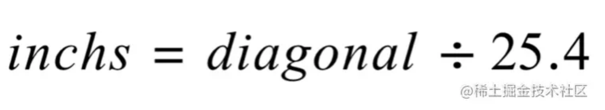

比如 iPhone 的尺寸 3.5寸、4寸、4.7寸、5.5寸 就是这样计算出来的。

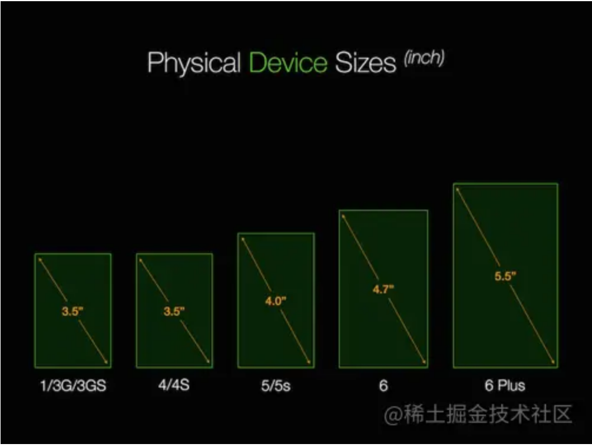

### 2、物理像素

我们在手机屏幕上看到的画面，本质上都是由一个个发光的物理像素组成，物理像素是构成屏幕图像的最小单元。

我们常说的屏幕分辨率，就是指这个屏幕上拥有多少个物理像素。

比如： iPhone4 的分辨率是 640 × 960，即屏幕在水平方向上有 640 个像素，在垂直方向上有 960 个像素。

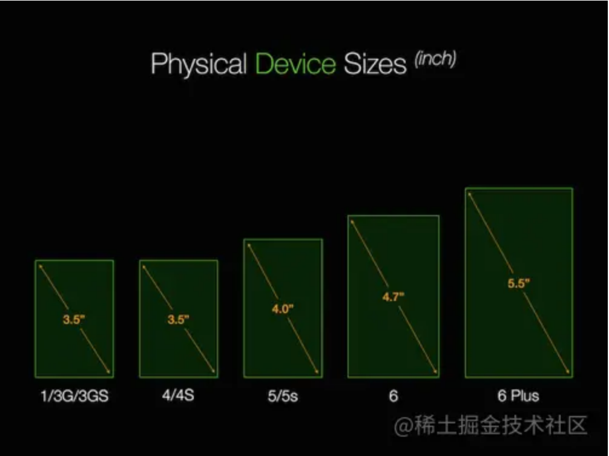

通常，设计师给的UI设计稿上的“px”指的就是物理像素。

### 3、像素密度 - PPI

PPI（Pixel Per Inch by diagonal）：表示对角线上每英寸所拥有的像素个数。

计算PPI，可以先利用勾股定理计算出对角线上的像素数，然后再除以屏幕尺寸，即：

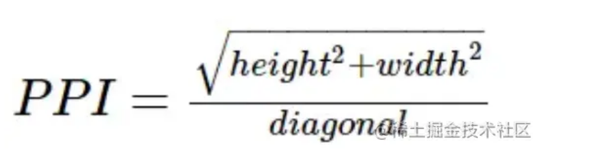

把 iPhone 8 屏幕数据代入公式，即可得出 iPhone8 的 PPI :

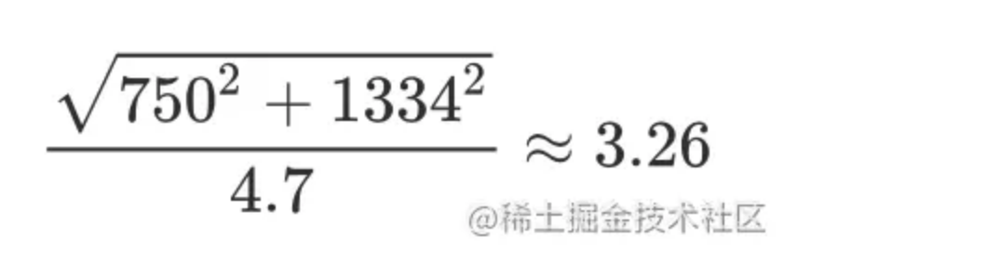

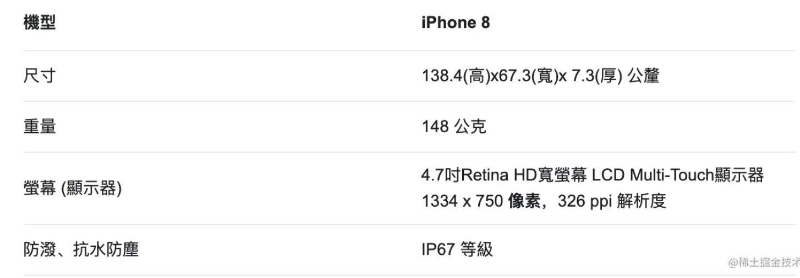

PPI 的值越大，每英寸屏幕上的物理像素点就越多越密集，渲染出来的画面也更加细腻、清晰。


比如，iPhoneXR 和 iPhone13Pro 拥有相同大小的屏幕尺寸6.1英寸。但前者的分辨率是 1792*828 可以算出PPI为 326，而后者的分辨率是 2778 x 1284 ，PPI 是458 。

这就使得 iPhone13Pro 在画面呈现上比 iPhoneXR 更加清晰和细腻。

### 4、PPI导致的问题

我们先看看下面的两张图有什么区别？


很明显，左图看起来要比右图舒服、清楚。

左图字体大小适中，图片文字都能看的清楚，相比而言，右图字体就太小了，让用户阅读变得困难。

那么，这个问题是怎么造成的呢？

为了搞清楚这个问题，我们先来做一个对比实验，如下图所示

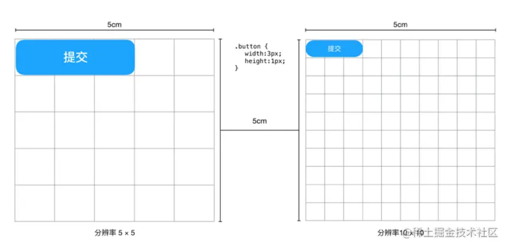

左图和右图分别代表两块尺寸相同的屏幕，长度和宽度均为 5cm，屏幕上的每个方格代表一个物理像素点。

唯一不同的是，左边屏幕分辨率为5 × 5，而右边屏幕分辨率为 10 × 10 。

现在屏幕上放了一个按钮，宽度为3px，高度为1px，css 样式如下：

```
.button {
	width: 3px;
  height: 1px
}
```

从图上效果可以看出，虽然我们为两个按钮设置了相同的样式，但右屏上的按钮比左屏上的按钮小了很多。

所以我们会发现，相同尺寸的屏幕，像素点越多，每个物理像素点看起来就越小，从而导致渲染出来的图像就会越小。

也就是说，**设置相同大小的样式，屏幕的 PPI 越大，渲染出来的图像就越小**。

这其实是一个问题。

在移动应用时代，手机的大小和分辨率参差不齐，从而导致 PPI 也不尽相同。

当我们把一个web页面放到不同设备上浏览时，就会出现“大小各异”的效果，这违背了我们对 css 样式 “所见即所得” 的认知。

为了让同一个元素在所有设备上看起来都差不多大，设备厂商给屏幕增加了 “**缩放因子**”。

### 5、缩放因子 - dpr

这里所谓的缩放因子，并不是对图像本身进行缩放，而是使用更多的物理像素来渲染同一个元素。

> 想到了这次冬奥会上的超大屏幕预防黑点的设计，相邻的三排显示同一个画面。

如下图所示，同样大小的矩形元素（灰色条），在第一个屏幕上采用 8×1 个物理像素来渲染，而在第二个屏幕上采用 16×2 个物理像素来渲染，在第三个设备上则采用 24×3 个物理像素来渲染。

**这样做的目的是为了让这个元素在不同设备上看起来差不多大小。**

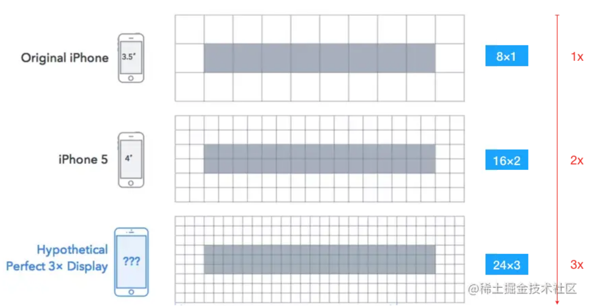

从图上可以看出，屏幕的 PPI 越大，需要的物理像素就越多。如果以第一个屏幕为基准，三个屏幕对应的物理像素数，可以用一个倍率来表示，即 1x、2x、3x。

通常，我们把这个倍率叫做 “缩放因子”。缩放因子是移动端响应式的关键因素。

而在页面开发过程中，**我们所说的“DPR”其实指的就是缩放因子**。 DPR 是 “device pixel ratio” 的缩写，即设备像素比。

**这里需要注意的是**：DPR 的大小并不是通过固定公式计算出来的，而是厂商给屏幕设置的一个固定值，出厂时就确定了，它的大小不会随着程序的设置而改变。

### 6、dpr和ppi的对应关系

不同平台定义DPR 的基线PPI是不同的。

由于第一代 iPhone 的 PPI 是163，所以苹果把 163 作为缩放基线。

在 iPhone 中，PPI=163 是 1x 屏；PPI=326 是 2x 屏；PPI=401 是 3x 屏；PPI=458 也是 3x 屏，对应的 DPR 分别为 1、2、3、3。

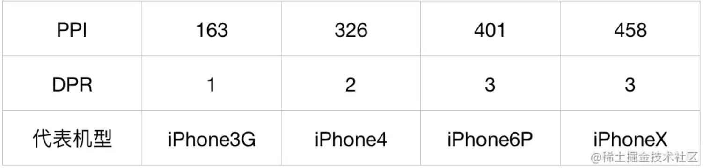

而 Android 屏幕的缩放基线 PPI 是160，所以 PPI=160 是 1x 屏，PPI=320 是 2x 屏。

 可以看出: 在 Android 上，DPR 和 PPI 基本上呈现为一个固定关系，但未来出现的屏幕**未必会遵循**这个规律。

所以，有这样一个重要结论：

**DPR 和 PPI 呈正相关，但不成正比，我们无法通过特定的公式来计算它的值。**

### 7、逻辑像素、逻辑分辨率

对于同一个元素，DPR 越大，渲染时需要的 **物理像素** 就越多。这是我们上面得出的结论。

那么，在页面开发中，元素的大小到底应该写成多少px ？

为了解决这个问题，我们引入 “**逻辑像素**” 的概念。

平时我们在 css 中写的 px 指的就是逻辑像素，而不是物理像素，一个逻辑像素可以代表一个或多个物理像素。

假设，我们现在设置一个元素的css样式如下：

```
.el { 
	width: 8px; 
	height: 1px; 
}
```

那么，这个元素在不同屏幕上渲染方式是不同的：

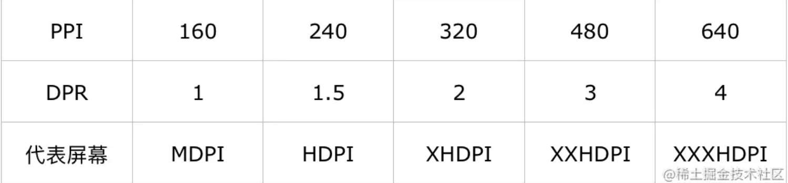

dpr=1 时，1 个逻辑像素 对应 1个物理像素。

dpr=2 时，1个逻辑像素 对应 2个物理像素，才能保证元素大小。

dpr=3 时，1个逻辑像素 对应 3个物理像素，才能保证元素大小。

因此，我们可以得出一个结论：

**一个逻辑像素所代表的物理像素个数与该屏幕的 DPR 成正比。**

**即：逻辑像素 (px) = 物理像素 / DPR**

有了这个公式，我们就能推导出屏幕的逻辑分辨率，也就是屏幕的逻辑宽度和逻辑高度。

- 逻辑宽度 = 水平物理像素 / DPR
- 逻辑高度 = 垂直物理像素 / DPR

比如 iPhone6 的物理分辨率为 750 × 1334，DPR = 2, 带入公式就可以得出其逻辑分辨率：

- 逻辑宽度 width = 750 / 2 = 375px
- 逻辑高度 height = 1334 / 2 = 667px

因此，iPhone6 的逻辑分辨率为 375 × 667 。在JavaScript中，也可以通过 DOM API 来获取屏幕的逻辑分辨率

通常，我们在 CSS 中设置的元素尺寸，本质上都是基于逻辑分辨率进行布局的。

### 8、iPhone 常见的几种规格

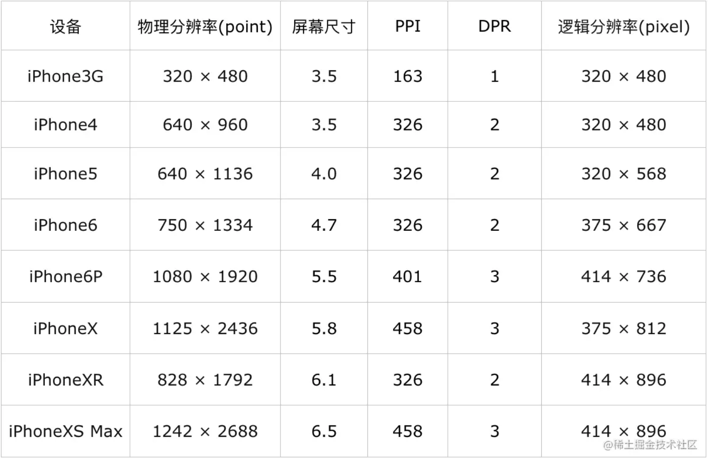

三、Viewport 1、viewport到底是什么 我们在写H5页面的时候，通常会在 html 的 head 中加入下面这句话：

## 三、Viewport

### 1、viewport到底是什么

我们在写H5页面的时候，通常会在 html 的 head 中加入下面这句话：

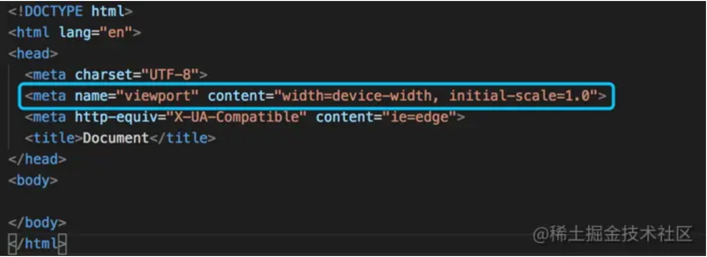

这句话就是在设置页面的 viewport 。那 viewport 到底是什么？为什么要设置它？

简单来说：**viewport 是屏幕背后的一张画布**。

### 2、Viewport 画布

浏览器会先把页面内容绘制到画布上，然后再通过屏幕窗口呈现出来。

画布的宽度可大可小, 当画布的宽度大于屏幕宽度时，画布上的内容就无法通过屏幕全部展示出来，用户可以通过屏幕手势来拖动画布查看被遮挡的部分。

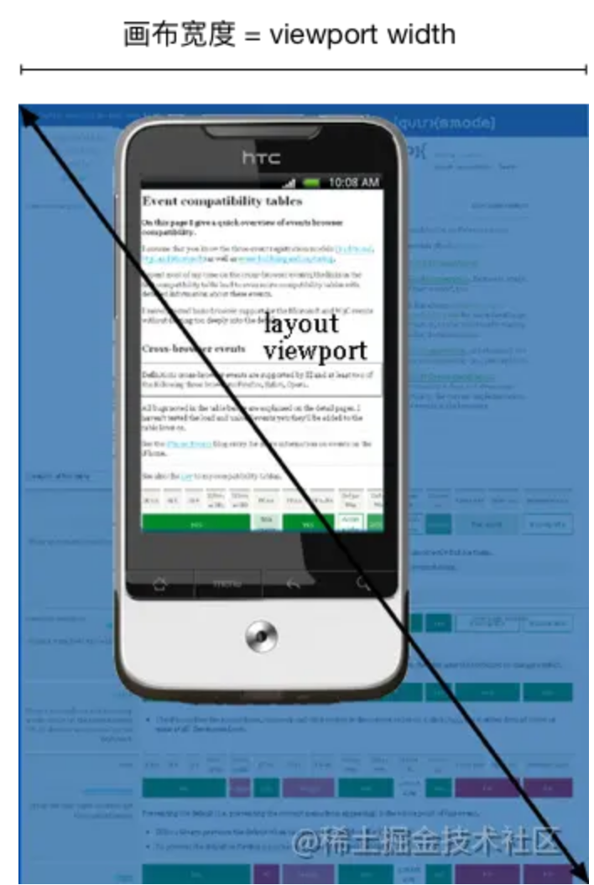

如果没有在 html 中加 viewport 的设置，画布其实也是存在的，浏览器会给画布设置一个默认宽度 ，不同平台的默认值如下：

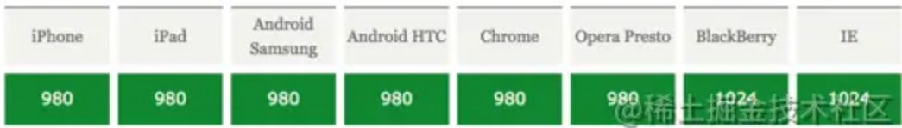

画布的宽度可以通过 DOM API 来获取： 

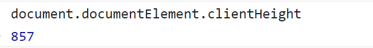

### 3、device-width 指的是什么？

device-width 指的是设备的物理宽度。device-height指的是设备的物理高度。也就是平常说的手机/电脑的分辨率。

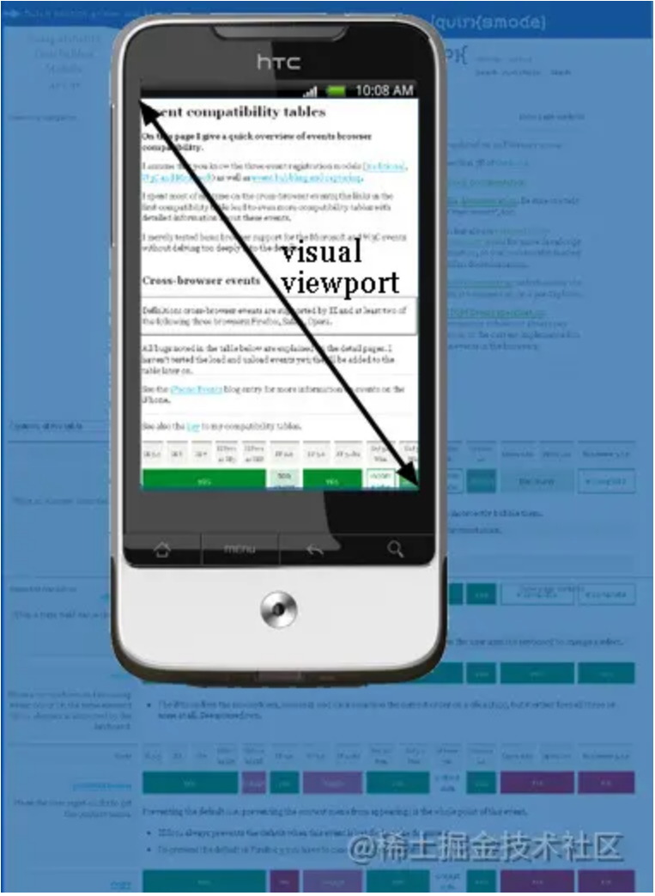

device-width/height 的大小可以通过 window.screen.width/height 来获取。

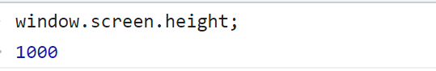

另外，

screen.availWidth：返回浏览器窗口**可占用**的水平宽度（单位：像素）。

screen.availHeight：返回浏览器窗口**可占用**的垂直宽度（单位：像素）。

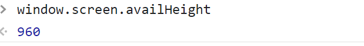

明确一点，是浏览器窗口可占用的宽度，而不是浏览器的总宽度。你可以理解为你屏幕的总宽度。

> chrome中移动端调试模式下，screen.availWidth是可以返回当前模拟器的水平宽度（模仿真机），但是一旦嵌套iframe，iframe中获取的screen.availWidth为当前屏幕的宽度。

### 4、width=device-width 在设置谁的宽度？

<meta name="viewport" content="width=device-width, initial-scale=1.0">

width 指的是画布的宽度，device-width 是可视窗口宽度。

width=device-width 就是把画布的宽度设置为可视窗口的宽度，让画布上的内容完全呈现出来。 

设置了 width=device-width 之后，画布的宽度就和屏幕的宽度一样大了。


5、画布缩放 - scale scale 是指画布以 device-width 大小为基准的缩放值。


**initial-scale=1.0 也就相当于设置了 width=device-width**

通常需要同时设置这两个值，这是因为两者在不同平台有兼容性问题：

 在iPhone 和 iPad 上，只支持 inital-scale=1 的设置，而在 IE 只支持 width=device-width ，所以两者同时设置，可以兼容所有的平台。

### 6、动态缩放机制

在没有给页面设置 viewport 的情况下，当画布宽度大于可视窗口的时候，浏览器会自动对画布进行缩放，以适配可视窗口大小。这样页面在不滚动的情况下也能呈现全部内容。

需要注意的是：

当没有设置 viewport 或者 设置了viewport 但没有设置 scale 的时候，才会触发浏览器动态缩放机制。

### 7、禁止动态缩放

给页面添加 viewport 设置，如下所示：  这种情况下，如果内容过大，那就需要通过滚动条来查看画布全部内容。

### 8、三个 Viewport

通常，我们把画布称为 **layout viewport**, 把屏幕可视窗口称为 **visual viewport**。

而把设置 width=device-width 的画布称为 ideal viewport，即“理想视口”。


我们通常在 html 中设置 viewport 就是为了得到理想视口，方便用户阅览。

## 四、总结

最后，我们再回顾一下开篇提到的问题，其实不难理解，这是由于屏幕的 dpr 不同导致的。

一般情况下，PC 屏幕 dpr 是 1，即 1个逻辑像素 = 1个物理像素，而移动端的 dpr 通常都是 2 或 3，因此也就需要 2个或 3个物理像素来渲染。

这也是 “移动端1px边框” 的经典问题，理解了 viewport，这个问题就不难解决了。


