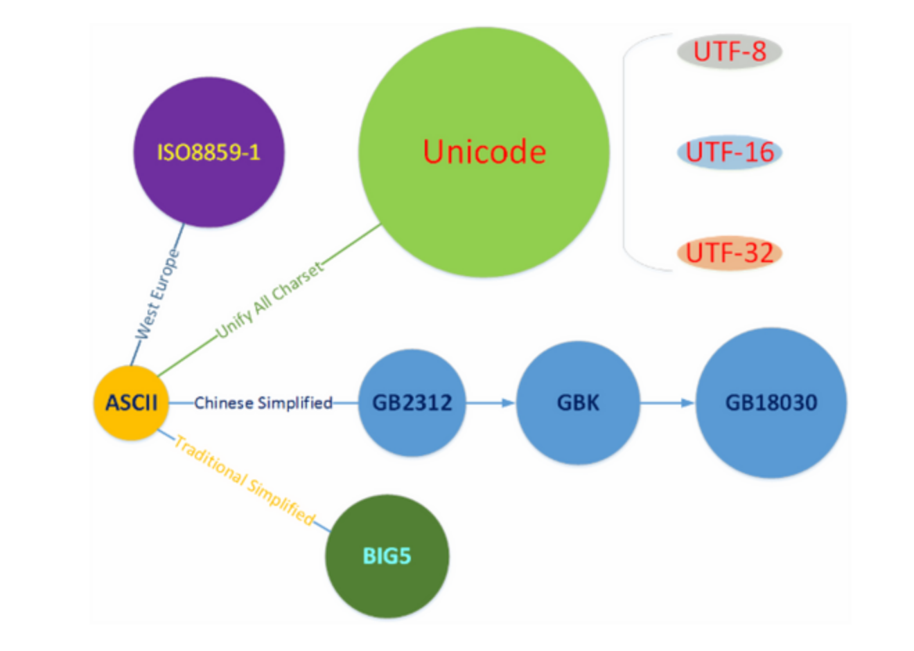
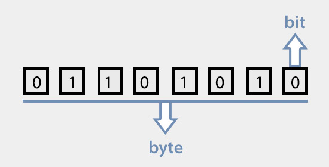

https://www.cnblogs.com/benbenalin/tag/%E5%AD%97%E7%AC%A6%E7%BC%96%E7%A0%81/

#### 一、前言

​		字符编码在计算机体系当中非常之重要，网络上关于字符编码的信息纷繁复杂，也没有一个成体系介绍的书籍，导致大家很困惑抓狂。记录一下自己的理解和体会。

#### 二、关键术语解释

##### 1、位

​		也叫bit(比特)，也可叫做比特位、位元、位，指的是二进制数中的1位，是计算机中信息表示的最小单位。Bit是Binary digit（二进制数位）的缩写，由数学家John Wilder Tukey提出，习惯上以小写字母b表示，如8比特可表示为8b。

​		每个比特有0和1两个可能的值，除了代表数值本身之外，还可代表：数值的正、负；逻辑的真、假；电灯的开、关；某根导线上电压的有、无等等。

##### 2、字节

​		在计算机中，通常都会使用一连串比特（称之为 bit string比特串）来进行处理、运算、操作，而不是使用1位比特。很显然，计算机系统也不会让你使用任意长度的比特串，而是使用某个特定长度的比特串。

​		一些常见的位串长度形式具有约定好的名称，如，半字节(nibble，貌似用的不多)代表4个位的组合，字节(byte)代表8个位的组合，10字节(Ten byte，简写为Tbyte)代表80个位的组合。

​		字节(byte)，又称为位元组，是计算机中计量存储容量和传输容量的一种基本计量单位，是由连续的、固定数量的比特所组成的比特串，一般由8个位组成，即1 byte = 8 bit。习惯上用大写的B表示，如3字节可表示为3B。

​		现代个人计算机(PC)的存储器编址，一般是以字节为单位的，称之为按字节编址，因此字节一般也是存储器的最小存取单元以及处理器的最小寻址单位（也有按位寻址、按字寻址等等，但在个人计算机上应用不普遍，这里不讨论）。

##### 3、字和字长

​		字（Word）：在计算机中，一串比特位（位串、比特串）是作为一个整体来处理或运算的，这串比特位称为一个计算机字，简称字。字通常分为若干个字节（每个字节一般是8位）。

​		字长（Word Length）：即字的长度，是指计算机的每个字所包含的位数。字长决定了CPU一次操作所处理的实际比特位数量的多少。字长由CPU对外数据通路的数据总线宽度决定。

​		计算机处理数据的速率，显然和它一次能加工的位数以及进行运算的快慢有关。如果一台计算机的字长是另一台计算机的两倍，若两台计算机的速度相同，在相同的时间内，前者能做的工作一般是后者的两倍。因此，字长与计算机的功能和用途有很大的关系，是计算机的一个重要技术指标。

​		在目前来讲，桌面平台的处理器是一般都是64位（那么1个字就是8字节，字长就是64位），嵌入式设备基本稳定在32位，而在某些专业领域（如高端显卡）处理器的字长早已经达到了128位乃至更多的256位。

##### 4、字符集

​		字符集（Character Set、Charset），字面上的理解就是字符的集合，是一个自然语言文字系统支持的所有抽象字符的集合。字符是各种文字和符号的总称，包括文字、数字、字母、音节、标点符号、图形符号等。

​		例如ASCII字符集，定义了128个字符，GB2312定义了7445个字符。而计算机系统中提到的字符集准确地来说，指的是已编号的字符的有序集合（但不一定是连续的）。

##### 5、编码

 		编码(Encode)，是信息从一种形式或格式转换为另一种形式或格式的过程，比如用预先规定的方法将字符(文字、数字、符号等)、图像、声音或其它对象转换成规定的电脉冲信号或二进制数字。

##### 6、解码

​		编码的逆过程。

##### 7、字符编码

​		字符编码(Character Encoding)，是把字符集中的字符按一定格式编码为某指定集合中某一对象的过程，亦即在字符集与指定集合两者之间建立一个对应关系(或映射关系)的过程。这是信息处理的一项基础技术。

​		比如把字符集中的字符编码为：由0和1两个数字所组成的位串、由0~9十个数字所组成的自然数序列、电压脉冲等等。

​		而在计算机科学中，通常以字符集来表达信息，以计算机为基础的信息处理系统则利用电子元件(硬件)的不同状态的组合来表示、存储和处理信息。电子元件不同状态(一般是开和关两种状态)的组合能代表数字系统中的数字(比如开和关代表二进制中的0和1)，因此字符编码的过程也就可以理解为将字符转换为计算机可以接受的二进制数字的过程，其目的是为了便于字符在计算机中表示、存储、处理和传输(包括在网络中传输)。

​		常见的例子包括将拉丁字母表编码成摩斯电码和ASCII码。其中，ASCII将字母、数字和其它符号进行编号，并且在计算机中直接用7比特的二进制数字来表示这个编号。通常会额外地在最高位(即首位)再增加一个扩充的比特位“0”，以便于计算机系统刚好以1个字节(8比特位)的方式来进行处理、存储和传输。

##### 8、字符编码模型

​		字符编码模型(Character Encoding Model)，是反映字符编码系统的结构特点和各构成部分相互关系的模型框架。

​		由于历史的原因，早期一般认为字符集和字符编码是同义词，并不需要进行严格区分。因此在像ASCII这样的简单字符集为代表的传统字符编码模型中，这两个概念的含义几乎是等同的。

​		因为在**传统字符编码模型**中，基本上都是将字符集里的字符进行编号(字符编号转化为二进制数后一般不超过一个字节)，然后该字符编号就是字符的编码。

​		但是，由统一码(Unicode)和通用字符集(UCS)为代表的**现代字符编码模型**则没有直接采用ASCII这样的**简单字符集**的编码思路，而是采用了一个全新的编码思路。

​			1）有哪些字符；

​			2）这些字符的编号是什么；

​			3）这些编号如何编码成一系列逻辑层面有限大小的数字，即**码元序列**；

​			4）这些逻辑层面的**码元序列**如何转换为物理层面的**字节序列**；

​			5）在某些特殊的传输环境中(比如Email)，再进一步将**字节序列**进行适应性编码处理。

​		现代字符编码模型之所以要分解为这么几个方面，其核心思想是创建一个能够用**不同方式**来编码的**通用**字符集。注意这里的关键词：“**不同方式**”与“**通用**”。这意味着，同一个字符集，可以通用于不同的编码方式，也就是说可以采用不同的编码方式来对同一个字符集进行编码。字符集与编码方式之间的关系可以是一对多的关系。

​		更进一步而言，在**传统字符编码模型**中，字符编码方式与字符集是紧密结合在一起的。而在现代字符编码模型中，字符编码方式与字符集脱钩了。用软件工程的专业术语来说，就是将之前紧密**耦合**在一起的字符编码方式与字符集**解耦**了。

